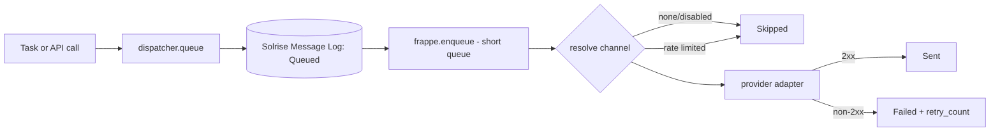

# Stage 4b - Notifications, Reporting and Retention

**Goal:** cover scope modules 6 (Notifications) and 7 (Reporting & Analytics), plus
the audit retention policy that closes module 8 (Administration).

**Milestones covered:** M9 (notifications), M10 (reporting + audit hardening).

Code lives in `apps/solrise_erp/` and is applied automatically by `after_migrate`.

---

## 7.1 Notification matrix

| Channel | Mechanism | Configured in |
|---------|-----------|---------------|
| Email | Solrise `Notification` + `frappe.sendmail` | `notifications.py`, `tasks.py`, **Email Account** |
| In-app | `Notification Log` + `frappe.publish_realtime` | `tasks.py` |
| SMS | Twilio (or Generic HTTP) | `Solrise Notification Channel` |
| WhatsApp | Meta Cloud API or Twilio | `Solrise Notification Channel` |

SMS/WhatsApp is a separate path on purpose: a `Notification` document cannot
address a phone number, so `tasks.py` calls `channels.dispatcher` directly.

### What fires today

| Event | In-app | Email | SMS/WhatsApp |
|-------|--------|-------|--------------|
| SLA breach (every 15 min scan) | yes | via `Solrise SLA Breach Alert` | yes, if messaging enabled |
| Stale ticket (hourly) | yes | no | no |
| New ticket | via `Solrise New Ticket` | yes | no |
| Pending approval | via `Solrise Approval Pending` | yes | no |
| High-value quotation | via `Solrise High Value Quotation` | yes | no |
| Daily digest | no | yes | no |
| Weekly report | no | yes | no |

Cooldown keys in Redis (`solrise_sla_notified:*`, `solrise_stale_notified:*`)
prevent a persistent condition from generating an alert every scan.

---

## 7.2 Configuring a messaging channel

### Option A - the Desk

1. Create **Solrise Notification Channel**.
2. Pick **Channel Type** (`WhatsApp` / `SMS` / `Webhook`) and **Provider**.
3. Fill the connection block (below), set **Default Recipients**, tick **Is Default**.
4. In **Solrise Settings**, tick **Enable SMS / WhatsApp** and select the channel
   as **Default Channel**.
5. Test: `solrise_erp.api.v1.send_test_message` (synchronous, returns the log).

### Option B - programmatic (required if you want it in fixtures)

```python
import frappe

frappe.get_doc({
    "doctype": "Solrise Notification Channel",
    "channel_name": "Support WhatsApp",
    "enabled": 1,
    "is_default": 1,
    "channel_type": "WhatsApp",
    "provider": "Meta WhatsApp Cloud API",
    "api_base_url": "https://graph.facebook.com/v21.0",
    "phone_number_id": "<id>",
    "api_key": "<permanent-token>",
    "default_country_code": "+92",
    "from_number": "+92...",
    "rate_limit_per_minute": 30,
    "default_recipients": "+923001234567, +923009876543",
}).insert(ignore_permissions=True)
```

### Credentials per provider

| Provider | Required fields |
|----------|-----------------|
| Meta WhatsApp Cloud API | `api_base_url`, `phone_number_id`, `api_key` (permanent token) |
| Twilio (SMS) | `account_sid`, `auth_token`, `from_number`; base URL optional |
| Twilio (WhatsApp) | as above, `channel_type = WhatsApp`, `from_number = whatsapp:+1...` |
| Generic HTTP | `api_base_url`; bearer `api_key` optional |

All secrets are `Password` fields, encrypted at rest by Frappe. They are
**not** exported as fixtures.

---

## 7.3 Message delivery flow



Properties:

- **Never inline.** A slow provider cannot pin a gunicorn worker; the user
  request only writes a log row and returns.
- **Rate limited** per channel per minute using a Redis counter
  (`solrise_msg_rl:<channel>:<YYYYMMDDHHMM>`).
- **Audited.** Every attempt is a `Solrise Message Log` row with the provider's
  raw response (truncated to 2 KB) so failures are diagnosable.
- **Number normalisation** applies `default_country_code` to bare local numbers.

### Testing

```python
# synchronous, returns {"log": "SML-00001", "status": "Sent"}
frappe.call("solrise_erp.api.v1.send_test_message", {"channel": "Support WhatsApp"})
```

From the shell:

```bash
podman exec -it solrise-backend bench --site erp.localhost execute \
  solrise_erp.api.v1.health
```

---

## 7.4 Reports

Nine Query Reports are created as **non-standard** `Report` documents, so they
export as fixtures and travel with the app.

| Report | Reference DocType | Purpose |
|--------|-------------------|---------|
| `Solrise CRM Pipeline` | Opportunity | open pipeline by status + value |
| `Solrise Ticket SLA` | Issue | tickets and breaches by SLA status |
| `Solrise Agent Performance` | Issue | totals, closed, open, average age per owner |
| `Solrise Workload` | Issue | open / high-priority / unassigned per owner |
| `Solrise HR Headcount` | Employee | active headcount by department and type |
| `Solrise Approval Backlog` | Leave Application | applications by workflow state |
| `Solrise Assistant Usage` | Solrise Chat Log | turns, tokens, latency per day |
| `Solrise Message Delivery` | Solrise Message Log | messages by channel and status |
| `Solrise Audit Trail` | Activity Log | events per user/operation (30 days) |

Run them from **Desk -> Reports**, or:

```bash
podman exec -it solrise-backend bench --site erp.localhost execute \
  frappe.desk.query_report.run --kwargs "{'report_name': 'Solrise Ticket SLA'}"
```

### Adding a report

Append to `REPORTS` in `reports.py` using Frappe's column syntax:

```python
{
    "report_name": "Solrise My Report",
    "ref_doctype": "Issue",
    "query": """
select
  i.status as "Status:Data:160",
  count(*) as "Count:Int:100"
from `tabIssue` i
group by i.status
order by count(*) desc
""",
},
```

Then `bench --site <site> execute solrise_erp.install.apply_all` (or any
`bench migrate`) to create it. Export fixtures afterwards.

> The queries are static SQL with no `%(param)s` placeholders, so they run
> without a filters definition. Add a `filters` block on the Report if you want
> date-range prompts.

---

## 7.5 Dashboards

`dashboards.py` creates five public `Dashboard Chart` documents and links them
into the **Solrise Operations** dashboard:

- Open tickets by status (donut)
- Ticket trend (line, daily)
- Pipeline by status (bar)
- Headcount by department (bar)
- Assistant turns (line, daily)

Open **Desk -> Dashboard -> Solrise Operations**. Dashboard Chart field names
have drifted between releases, so `setup_helpers.upsert` filters each value
through the DocType meta - an unknown field is skipped, not fatal.

---

## 7.6 Log retention

Retention lives in **Solrise Settings**, not in code defaults, so it can be
tuned per deployment:

| Setting | Default | Applies to |
|---------|---------|-----------|
| `enable_log_purge` | on | master switch |
| `chat_log_retention_days` | 90 | `Solrise Chat Log` |
| `message_log_retention_days` | 180 | `Solrise Message Log` |

`tasks.purge_old_logs` runs daily at 03:00 and bulk-deletes rows older than the
window. Chat logs contain user text and record names, so treat retention as a
data-protection control, not housekeeping.

---

## 7.7 Security notes

- `solrise_erp.api.v1.notify` is **not** in `assistant_allowed_methods`. The
  model cannot send an SMS/WhatsApp; only a human or an integration can.
- `notify` requires **write** permission on the target channel, so access is
  grantable per role without exposing every channel.
- Provider credentials are encrypted `Password` fields and are excluded from
  fixtures.
- Message bodies are truncated to 5,000 characters on queue to bound storage and
  provider cost.

---

## Exit criteria

- [ ] A channel is configured and `send_test_message` returns `Sent`
- [ ] A manual SLA breach produces an in-app alert and, if enabled, an SMS
- [ ] `Solrise Message Log` shows the attempt with the provider response
- [ ] All nine reports run without SQL errors
- [ ] **Solrise Operations** dashboard renders all five charts
- [ ] `purge_old_logs` reports a deletion count in the scheduler log
