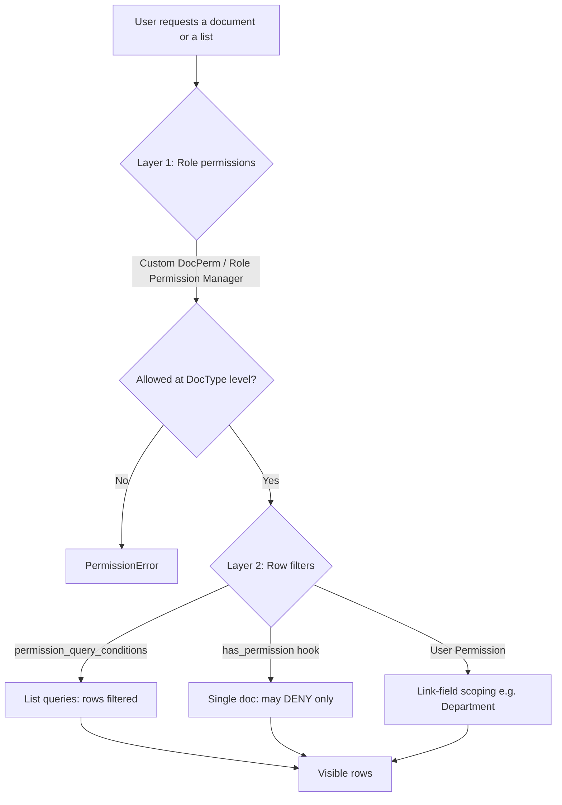

# 11 - Role-Based Access Control (RBAC)

**Scope:** the complete Solrise role catalogue, DocType permission matrix,
row-level restrictions, workflows, Frappe-UI configuration steps and the
migration-safe custom-app patterns that keep it all in code.

**Applies to:** `apps/solrise_erp/` on top of `frappe` + `erpnext` + `hrms`.

**Related files**

| File | Role in RBAC |
|------|--------------|
| `scripts/roles_rbac.py` | Declarative role + `Custom DocPerm` matrix (Stage 2) |
| `apps/solrise_erp/solrise_erp/permissions.py` | `permission_query_conditions` + `has_permission` functions |
| `apps/solrise_erp/solrise_erp/hooks.py` | Registers the permission hooks, fixtures, `after_migrate` |
| `apps/solrise_erp/solrise_erp/install.py` | Idempotent `after_install` / `after_migrate` entry point |
| `apps/solrise_erp/solrise_erp/workflows.py` | Approval workflows as code |
| `apps/solrise_erp/solrise_erp/setup_helpers.py` | `ensure_roles()` / `upsert()` version-safe helpers |

---

## 0. The two-layer model (read this first)

Frappe decides access in **two independent layers**. RBAC bugs almost always
come from configuring one and assuming the other.



**Layer 1 - Role permissions.** Stored as `DocPerm` (shipped with a DocType's
JSON) or `Custom DocPerm` (created by the Role Permission Manager or by code).
They answer *"may this role read/write/… this DocType at all?"*

**Layer 2 - Row filters.** They answer *"which rows?"*

| Mechanism | Applies to | Grants or denies? |
|-----------|-----------|-------------------|
| `if_owner` on a permission rule | single doc + lists | restricts to `owner == user` |
| `permission_query_conditions` hook | every `frappe.get_list` / report / link search | **restricts** (adds a WHERE clause) |
| `has_permission` hook | single doc (`frappe.get_doc` checks, save, submit) | **denies only** |
| User Permission | any DocType with a matching Link field | restricts by linked value |
| DocShare | a single document | **grants** extra access |

### Three rules that prevent 90% of RBAC defects

1. **`has_permission` hooks can only deny.** From
   `frappe/permissions.py: has_controller_permissions()` - "Controllers can only
   deny permission, they can not explicitly grant any permission that wasn't
   already present." So to give *assigned agents* access you must grant the
   `Support Agent` role a **broad** (not `if_owner`) `read`/`write` on `Issue`,
   then let `has_permission` deny the unassigned rows.

2. **`if_owner` matches the `owner` field only - not assignees.** An agent in
   `_assign` will *not* pass an `if_owner` check. Use `if_owner` only when
   nobody else ever needs access (e.g. a portal customer's own ticket). For
   owner-**or**-assignee use broad role permission + `permission_query_conditions`
   + `has_permission` (implemented in `permissions.py`).

3. **Any `Custom DocPerm` row for a DocType replaces that DocType's shipped
   permissions.** In `frappe.permissions.get_valid_perms()`:

   ```python
   doctypes_with_custom_perms = get_doctypes_with_custom_docperms()
   for p in perms:                       # DocPerm
       if p.parent not in doctypes_with_custom_perms:
           custom_perms.append(p)
   ```

   The Role Permission Manager is safe because `setup_custom_perms()` first
   **copies** every existing `DocPerm` into `Custom DocPerm`. A script that
   *inserts* `Custom DocPerm` directly (like `roles_rbac.py`) does **not** copy,
   so it must re-declare **every** role that needs access - including
   `System Manager` and `All` where relevant. Verify after any change with the
   `get_valid_perms` command in section 10.

---

## 1. Role catalogue

`desk_access = 1` means Desk/System User; `0` means Website/Portal User.
"Standard" roles ship with `frappe`/`erpnext`/`hrms` - **never recreate them**,
`ensure_roles()` skips roles that already exist.

| # | Matrix role | Role name(s) to assign | Origin | Desk access | Portal |
|---|-------------|----------------------|--------|:-----------:|:------:|
| 1 | Customer / External User | `Customer` | Standard (ERPNext) | 0 | yes |
| 2 | Employee | `Employee` | Standard (HRMS) | 1 | optional |
| 3 | Agent / Support Executive | `Support Agent` | **Custom** | 1 | no |
| 4 | Sales / CRM Executive | `CRM User` (+ optional standard `Sales User`) | **Custom** | 1 | no |
| 5 | HR Executive | `HR User` | Standard (HRMS) | 1 | no |
| 6 | Manager / Approver | `Support Manager`, `CRM Manager`, `Leave Approver`, `Expense Approver` | Custom + Standard | 1 | no |
| 7 | Department Head | `Department Head` (+ `Leave Approver`, `Expense Approver`) | **Custom** | 1 | no |
| 8 | System Administrator | `System Manager` | Standard (Frappe) | 1 | no |
| 9 | Super Administrator | `Solrise Super Admin` (+ `System Manager`) | **Custom** | 1 | no |

Automatic roles - **do not assign by hand**: `All`, `Guest`, `Desk User`
(`SYSTEM_USER_ROLE`, added automatically to System Users) and `Administrator`
(only the built-in `Administrator` user).

### Role Profiles (strongly recommended)

Assign **one Role Profile** per user instead of ticking roles individually.
That makes joiners/leavers a one-field change and keeps the matrix auditable.

| Role Profile | Roles in profile |
|--------------|------------------|
| Solrise Customer | `Customer` |
| Solrise Employee | `Employee` |
| Solrise Support Agent | `Support Agent` |
| Solrise Support Supervisor | `Support Agent`, `Support Manager` |
| Solrise CRM Executive | `CRM User` |
| Solrise CRM Supervisor | `CRM User`, `CRM Manager` |
| Solrise HR Executive | `HR User`, `Employee` |
| Solrise Department Head | `Employee`, `Department Head`, `Leave Approver`, `Expense Approver` |
| Solrise Finance Approver | `Finance Approver`, `Employee` |
| Solrise Administrator | `Solrise Admin`, `System Manager` (break-glass only) |
| Solrise Super Administrator | `Solrise Super Admin`, `System Manager` |

---

## 2. Per-role breakdown

Each block: responsibilities -> what they can do -> the restriction mechanism.

### 2.1 Customer / External User - `Customer` (Website User)

- **Responsibilities:** create requests, view own tickets, respond to agents,
  upload documents, track status.
- **Base role:** standard `Customer` (website). For a branded, independent
  permission set you may instead create `Solrise Customer`; the trade-off is
  losing ERPNext's shipped portal grants, which you would then re-declare.
- **DocTypes:** `Issue` (R/W/C owner-only), `Communication`, `Comment`, `File`
  (create on tickets they own), `Contact` (own contact link).
- **Restriction:** `if_owner = 1` on `Issue` + the `permissions.py` fallback
  returns owner-only conditions for any non-agent role. **Never** give
  `report`, `export`, `delete` or `share`.
- **Setup:** `user_type = Website User`, no `System Manager`, no `All`-broad
  grants. Confirm the portal routes (`/support/issues`) resolve.

### 2.2 Employee - `Employee` (System User)

- **Responsibilities:** HR self-service, create IT/service tickets, view own
  records and approvals.
- **Base role:** standard `Employee` (HRMS self-service). Add `Employee` to the
  `Employee` DocType permission via `user_id`, not `if_owner` (HR creates the
  record, so `owner` is HR, not the employee).
- **DocTypes:** `Employee` (R own), `Leave Application` (R/W/C own, submit),
  `Expense Claim` (R/W/C own, submit), `Attendance Request`, `Issue`
  (R/W/C own), `Holiday List` (R).
- **Restriction:** `permissions.py` maps `Employee.user_id == user` for
  `Employee`, `Leave Application` and `Expense Claim`. HR keeps a broad role
  permission so the `has_permission` hook can narrow it safely.
- **Note:** HRMS ships much of this already; only verify and add `Issue`.

### 2.3 Agent / Support Executive - `Support Agent` (System User)

- **Responsibilities:** manage assigned tickets, communicate, update status,
  resolve and escalate.
- **DocTypes:** `Issue` (R/W/C/email/report, **broad** permission), `Service
  Level Agreement` (R), `Communication`/`File` (C on accessible tickets).
- **Restriction:** **broad** `read`/`write` on `Issue` (no `if_owner`) so the
  `has_permission` hook can allow assignees; `issue_query_conditions` limits
  lists to `owner = user OR _assign contains user OR lead/assignee`. `delete`
  is **not** granted - agents resolve, managers delete.
- **Escalation:** the `Escalate` workflow transition is available to the
  `Support Manager`; an agent requesting escalation uses the assignment rule /
  notification, not a permission.

### 2.4 Sales / CRM Executive - `CRM User` (System User)

- **Responsibilities:** manage leads, contacts, opportunities, activities and
  customer communications.
- **DocTypes:** `Lead` (R/W/C/email/report, broad), `Opportunity` (R/W/C/report,
  broad), `Contact` (R/W/C), `Quotation` (R/W/C), `Customer` (R).
- **Restriction:** row filter is `owner = user OR lead_owner = user OR
  opportunity_owner = user OR _assign contains user`. `delete` and `export`
  belong to `CRM Manager`; `Quotation` submit/cancel/amend belong to
  `CRM Manager`.

### 2.5 HR Executive - `HR User` (System User)

- **Responsibilities:** manage employee lifecycle, leave, onboarding, documents
  and HR workflows.
- **DocTypes:** `Employee` (R/W/C), `Leave Application` (R/W/C/submit/cancel),
  `Leave Allocation` (R/W/C/submit), `Attendance Request` (R/W/C),
  `Expense Claim` (R/W/C), `Department` (R/W/C), `Holiday List` (R/W/C),
  `Employee Onboarding`/`Employee Separation` (R/W/C if installed).
- **Restriction:** HR is intentionally **unrestricted at row level** but
  **scoped by User Permission** to their `Company` (and optionally
  `Department`) - see section 4.3. Do not give `delete` on `Employee`; use
  `cancel`/`amend` on submittables and status changes.

### 2.6 Manager / Approver - `Support Manager`, `CRM Manager`, `Leave Approver`, `Expense Approver`

- **Responsibilities:** approve/reject requests, monitor team workload and
  escalations.
- **DocTypes:** manager roles get full CRUD(+`share`, +`export`) on their
  domain (`Issue` / `Lead`+`Opportunity`); approver roles get
  `Leave Application` and `Expense Claim` read/write so the workflow transition
  can act.
- **Restriction:** approver rows are filtered to where they are the named
  approver (`leave_approver`, `expense_approver`); managers see everything in
  their domain. `allow_self_approval = 0` on every workflow transition
  (separation of duties).
- **Note:** a person is often both `Support Agent` and `Support Manager` -
  assign both (or the `Solrise Support Supervisor` Role Profile).

### 2.7 Department Head - `Department Head` (System User)

- **Responsibilities:** approve higher-value requests, review KPIs and
  department reports.
- **DocTypes:** team-scoped read on `Employee`, `Issue`, `Leave Application`,
  `Expense Claim`; approve via workflow; read access to department reports and
  the `Solrise` dashboards.
- **Restriction:** a **User Permission for `Department`** plus the
  `_user_permission_docs()` helper in `permissions.py`, which turns that
  permission into
  `employee IN (SELECT name FROM tabEmployee WHERE department IN (...))`.
  This is the one place where User Permissions and a custom query condition are
  used together on purpose.
- **Higher-value approvals:** model the threshold in the workflow (or an
  `Approve` transition condition), not in the role. A Department Head approving
  an amount above their limit should route to `Finance Approver`.

### 2.8 System Administrator - `System Manager` (System User)

- **Responsibilities:** configure users, roles, workflows, SLAs, integrations
  and security.
- **DocTypes:** everything needed to operate the platform: `User`, `Role`,
  `Role Profile`, `User Permission`, `Workflow`, `Workflow State`,
  `Workflow Action Master`, `Notification`, `Service Level Agreement`,
  `Assignment Rule`, plus read/write on business DocTypes.
- **Restriction:** `System Manager` **bypasses** most Solrise row filters (the
  `permissions.py` functions return neutral values for it). Keep the number of
  `System Manager` users as small as practical; day-to-day operations belong to
  `Solrise Admin`.

### 2.9 Super Administrator - `Solrise Super Admin` (System User)

- **Responsibilities:** full platform governance, audit, configuration and
  emergency access.
- **DocTypes:** governance + audit: `Role`, `Custom DocPerm`/`DocPerm`,
  `User`, `User Permission`, `Workflow`, `Notification`, read-only on
  `Activity Log`, `Access Log`, `Error Log`, `Scheduled Job Log`.
- **Restriction:** none at row level (it is a break-glass role), but it is
  **not** `Administrator`. Enforce 2FA, an IP allow-list and full audit
  logging; review `Access Log` regularly. Never use the built-in
  `Administrator` user for daily work, and keep its password in a break-glass
  vault.

---

## 3. DocType permission matrix

Legend: **R** read · **W** write · **C** create · **D** delete · **S** submit ·
**X** cancel · **A** amend · **O** `if_owner` · **PQ** `permission_query_conditions`
· **UP** User Permission applies · **-** none.

Role codes: `CUS`=Customer · `EMP`=Employee · `AGT`=Support Agent ·
`CRMU`=CRM User · `HRU`=HR User · `SPV`=Support Manager · `CRMM`=CRM Manager ·
`DH`=Department Head · `FA`=Finance Approver · `ADM`=Solrise Admin ·
`SADM`=Solrise Super Admin.

### 3.1 Service Desk

| DocType | CUS | EMP | AGT | SPV | DH | ADM | SADM |
|---|:--:|:--:|:--:|:--:|:--:|:--:|:--:|
| Issue | R/W/C **O** | R/W/C **PQ** | R/W/C/email/report **PQ** | R/W/C/D/share/export | R **PQ/UP** | R/W/C/D | all |
| Service Level Agreement | - | - | R | R/W/C | R | R/W/C/D | all |
| Assignment Rule | - | - | - | R/W/C | R | R/W/C/D | all |
| Workflow Action | - | R **O** | R | R | R | R/W | all |
| Communication | R/C **O** | R/C | R/C | R/C/D | R | R/W/D | all |
| Comment | R/C **O** | R/C | R/C | R/C/D | R | R/W/D | all |
| File | R/C **O** | R/C | R/C | R/C/D | R | R/W/D | all |

Notes
- `AGT` is deliberately **broad** on `Issue` so the `has_permission` hook can
  permit assignees (rule 1 in section 0).
- `SPV` and above do not need row filters - `issue_query_conditions` returns `""`.
- `CUS` uses `if_owner`; portal users never get `report`/`export`/`share`.

### 3.2 CRM

| DocType | CRMU | CRMM | DH | ADM | SADM |
|---|:--:|:--:|:--:|:--:|:--:|
| Lead | R/W/C/email/report **PQ** | R/W/C/D/share/export | R (dept) | R/W/C/D | all |
| Opportunity | R/W/C/report **PQ** | R/W/C/D/export | R (dept) | R/W/C/D | all |
| Contact | R/W/C **PQ** | R/W/C/D | R | R/W/C/D | all |
| Customer | R | R/W/C | R | R/W/C/D | all |
| Quotation | R/W/C | R/W/C/S/X/A | R | R/W/C/D | all |
| Sales Order | R | R/W/S | R | R/W/C/D | all |

Notes
- `PQ` uses `owner` / `lead_owner` / `opportunity_owner` / `_assign`.
- `delete` is a manager right. Executives create and work, managers clean up.

### 3.3 HR

| DocType | EMP | HRU | DH | ADM | SADM |
|---|:--:|:--:|:--:|:--:|:--:|
| Employee | R **PQ** | R/W/C **UP** | R **PQ/UP** | R/W/C | all |
| Leave Application | R/W/C/S **PQ** | R/W/C/S/X **UP** | R/W/**PQ/UP** | R/W/C/D | all |
| Leave Allocation | R | R/W/C/S | R | R/W/C | all |
| Expense Claim | R/W/C/S **PQ** | R/W/C/S **UP** | R/W **PQ** | R/W/C | all |
| Attendance Request | R/C **PQ** | R/W/C | R | R/W/C | all |
| Department | - | R/W/C | R | R/W/C | all |
| Holiday List | R | R/W/C | R | R/W/C | all |

Notes
- `EMP` is scoped by `Employee.user_id`, not `owner` (HR owns the record).
- Salary/payroll fields use **permlevel 1** (section 4.4), not separate DocTypes.
- `HRU` row access is intentionally broad but fenced by **User Permission**
  on `Company`/`Department`.

### 3.4 Approvals / Finance

| DocType | FA | SPV | CRMM | DH | ADM | SADM |
|---|:--:|:--:|:--:|:--:|:--:|:--:|
| Payment Entry | R/W/S **PQ** | - | - | - | R/W/C | all |
| Purchase Order | R/S | - | - | - | R/W/C | all |
| Sales Invoice | R/S | - | - | - | R/W/C | all |
| Expense Claim | R/W/S **PQ** | - | - | R/W **PQ** | R/W/C | all |
| Workflow Action | R | R | R | R | R/W | all |

### 3.5 Administration & governance

| DocType | ADM | SADM | System Manager |
|---|:--:|:--:|:--:|
| User | R/W | R/W | R/W/C/D |
| Role / Role Profile | R | R/W | R/W/C/D |
| User Permission | R | R/W/C/D | R/W/C/D |
| Workflow / Workflow State / Workflow Action Master | R/W | R/W | R/W/C/D |
| Notification / Assignment Rule / SLA | R/W | R/W | R/W/C/D |
| Custom DocPerm / DocPerm | - | R | R/W/C/D |
| Activity Log / Access Log / Error Log | R | R | R |
| Scheduled Job Log | R | R | R |

`Role`/`Custom DocPerm` are deliberately **not** writable by `Solrise Admin` -
permission changes are a Super Administrator / change-management action.

---

## 4. Document-level / owner restrictions - when to use what

### 4.1 Decision table

| Requirement | Use | Why |
|---|---|---|
| User sees only records **they created**, nobody else ever needs them | `if_owner = 1` on the role permission | Zero code, enforced in lists and single docs |
| User sees **own + assigned** records | broad role perm + `permission_query_conditions` + `has_permission` | `if_owner` does not match `_assign` |
| Records of a **linked master** (Company, Department, Territory) | **User Permission** (+ `apply_strict_user_permissions`) | Declarative, applies to every Link field |
| Department Head needs **their department's** child records | User Permission on `Department` + custom condition via `_user_permission_docs()` | `Leave Application` has no `Department` field to hook the rule onto |
| One-off grant to one user | **Share** (DocShare) | Grants only; never use for bulk rules |
| Sensitive **fields** (salary, bank, API keys) | **Permission Level** on the field + a rule at that permlevel | Field-level, not row-level |

### 4.2 Why `permission_query_conditions` alone is not enough

It only rewrites queries that go through Frappe's query builder. It does **not**
protect:

- raw `frappe.db.sql(...)` and custom SQL in Query Reports;
- `frappe.db.get_value()`, `frappe.db.get_all(ignore_permissions=True)`;
- server-side `frappe.get_doc()` followed by unsaved reads.

`has_permission` covers the single-document path; **server scripts must still
call** `doc.check_permission()` or `frappe.has_permission(doc=doc)` explicitly
when they read with `ignore_permissions`. Never branch on permissions only in
the client - the client is cosmetic, the server is authoritative.

### 4.3 User Permission scoping (Department / Company)

1. Create the rule under **User Permission** (`allow = Department`,
   `for_value = Engineering`, `user = head@…`).
2. Leave `apply_to_all_doctypes` off unless you truly want it everywhere.
3. Turn on **System Settings -> Apply Strict User Permissions** only if empty
   link fields must also block access. It is aggressive - test first.
4. The `_user_permission_docs(user, "Department")` helper in `permissions.py`
   reads these rules back so the custom company/leave conditions stay in sync.

### 4.4 Permission Levels

- Set `permlevel` on the field (Customize Form) **and** add a role rule at the
  same permlevel. A rule at permlevel 0 does **not** grant access to a
  permlevel-1 field.
- `get_role_permissions()` ignores permlevel > 0 in its general pass; permlevel
  access is evaluated separately. Keep all field-level roles explicit.

Example: `Employee.ctc` / salary child table at permlevel 1 ->
`HR Manager` R/W at permlevel 1; `HR User` R at permlevel 1; `Employee` no rule.

---

## 5. Implementation in the custom app

Everything lives in `apps/solrise_erp/`. Nothing here is done through Server
Script - Server Scripts are not exported as fixtures and drift between
environments.

### 5.1 Register the hooks (`hooks.py`)

Add to `apps/solrise_erp/solrise_erp/hooks.py`:

```python
# Row-level permissions. The functions live in solrise_erp/permissions.py.
from solrise_erp.permissions import (
    permission_query_conditions,
    has_permission,
)
```

Or, if you prefer no module-level import in `hooks.py`, inline the maps:

```python
permission_query_conditions = {
    "Issue": "solrise_erp.permissions.issue_query_conditions",
    "Lead": "solrise_erp.permissions.lead_query_conditions",
    "Opportunity": "solrise_erp.permissions.opportunity_query_conditions",
    "Contact": "solrise_erp.permissions.contact_query_conditions",
    "Employee": "solrise_erp.permissions.employee_query_conditions",
    "Leave Application": "solrise_erp.permissions.leave_application_query_conditions",
    "Expense Claim": "solrise_erp.permissions.expense_claim_query_conditions",
}

has_permission = {
    "Issue": "solrise_erp.permissions.issue_has_permission",
    "Lead": "solrise_erp.permissions.lead_has_permission",
    "Opportunity": "solrise_erp.permissions.opportunity_has_permission",
    "Contact": "solrise_erp.permissions.contact_has_permission",
    "Employee": "solrise_erp.permissions.employee_has_permission",
    "Leave Application": "solrise_erp.permissions.leave_application_has_permission",
    "Expense Claim": "solrise_erp.permissions.expense_claim_has_permission",
}
```

Also extend the fixture filter so the new roles are exported and re-applied on
every deploy:

```python
SOLRISE_ROLES = [
    "Solrise Customer",
    "Support Agent",
    "Support Manager",
    "CRM User",
    "CRM Manager",
    "Department Head",
    "Finance Approver",
    "Solrise Admin",
    "Solrise Super Admin",
]

fixtures = [
    # ...
    {"dt": "Role",           "filters": [["role_name", "in", SOLRISE_ROLES]]},
    {"dt": "Custom DocPerm", "filters": [["role", "in", SOLRISE_ROLES]]},
    {"dt": "Role Profile",   "filters": [["name", "like", "Solrise%"]]},
    # ...
]
```

### 5.2 Extend the role + DocPerm matrix (`scripts/roles_rbac.py`)

The existing script already creates roles and grants `Custom DocPerm`s. Extend
it rather than replacing it, and **re-declare every role** for a DocType you
customise (section 0, rule 3).

```python
ROLES = [
    # (role_name, desk_access) - standard roles already exist and are skipped
    ("Solrise Customer", 0),   # Website / Portal user
    ("Employee", 1),           # standard HRMS role
    ("Support Agent", 1),
    ("Support Manager", 1),
    ("CRM User", 1),
    ("CRM Manager", 1),
    ("HR User", 1),            # standard HRMS role
    ("Department Head", 1),
    ("Finance Approver", 1),
    ("Solrise Admin", 1),
    ("Solrise Super Admin", 1),
]

GRANTS = {
    "Solrise Customer": [
        ("Issue", 0, {"read": 1, "write": 1, "create": 1, "if_owner": 1}),
    ],
    "Employee": [
        ("Issue", 0, {"read": 1, "write": 1, "create": 1}),          # narrowed by PQ
        ("Employee", 0, {"read": 1}),                                 # narrowed by PQ
        ("Leave Application", 0, {"read": 1, "write": 1, "create": 1, "submit": 1}),
        ("Expense Claim", 0, {"read": 1, "write": 1, "create": 1, "submit": 1}),
    ],
    "Support Agent": [
        ("Issue", 0, {"read": 1, "write": 1, "create": 1, "email": 1, "report": 1}),
        ("Service Level Agreement", 0, {"read": 1}),
        ("Communication", 0, {"read": 1, "create": 1}),
        ("File", 0, {"read": 1, "create": 1}),
    ],
    "Support Manager": [
        ("Issue", 0, {"read": 1, "write": 1, "create": 1, "delete": 1,
                      "email": 1, "report": 1, "export": 1, "share": 1}),
        ("Service Level Agreement", 0, {"read": 1, "write": 1, "create": 1}),
        ("Assignment Rule", 0, {"read": 1, "write": 1, "create": 1}),
        ("Workflow Action", 0, {"read": 1}),
    ],
    "CRM User": [
        ("Lead", 0, {"read": 1, "write": 1, "create": 1, "email": 1, "report": 1}),
        ("Opportunity", 0, {"read": 1, "write": 1, "create": 1, "report": 1}),
        ("Contact", 0, {"read": 1, "write": 1, "create": 1}),
        ("Customer", 0, {"read": 1}),
        ("Quotation", 0, {"read": 1, "write": 1, "create": 1}),
    ],
    "CRM Manager": [
        ("Lead", 0, {"read": 1, "write": 1, "create": 1, "delete": 1,
                     "report": 1, "export": 1, "share": 1}),
        ("Opportunity", 0, {"read": 1, "write": 1, "create": 1, "delete": 1,
                            "report": 1, "export": 1}),
        ("Contact", 0, {"read": 1, "write": 1, "create": 1, "delete": 1}),
        ("Quotation", 0, {"read": 1, "write": 1, "create": 1,
                          "submit": 1, "cancel": 1, "amend": 1}),
    ],
    "HR User": [
        ("Employee", 0, {"read": 1, "write": 1, "create": 1}),
        ("Leave Application", 0, {"read": 1, "write": 1, "create": 1,
                                  "submit": 1, "cancel": 1}),
        ("Leave Allocation", 0, {"read": 1, "write": 1, "create": 1, "submit": 1}),
        ("Expense Claim", 0, {"read": 1, "write": 1, "create": 1, "submit": 1}),
        ("Attendance Request", 0, {"read": 1, "write": 1, "create": 1}),
        ("Department", 0, {"read": 1, "write": 1, "create": 1}),
        ("Holiday List", 0, {"read": 1, "write": 1, "create": 1}),
    ],
    "Department Head": [
        ("Employee", 0, {"read": 1}),
        ("Issue", 0, {"read": 1}),
        ("Leave Application", 0, {"read": 1, "write": 1}),
        ("Expense Claim", 0, {"read": 1, "write": 1}),
        ("Workflow Action", 0, {"read": 1}),
    ],
    "Finance Approver": [
        ("Payment Entry", 0, {"read": 1, "write": 1, "submit": 1, "report": 1}),
        ("Purchase Order", 0, {"read": 1, "submit": 1}),
        ("Sales Invoice", 0, {"read": 1, "submit": 1}),
        ("Expense Claim", 0, {"read": 1, "write": 1, "submit": 1}),
    ],
    "Solrise Admin": [
        ("Workflow", 0, {"read": 1, "write": 1}),
        ("Notification", 0, {"read": 1, "write": 1, "create": 1}),
        ("Service Level Agreement", 0, {"read": 1, "write": 1, "create": 1, "delete": 1}),
        ("Assignment Rule", 0, {"read": 1, "write": 1, "create": 1, "delete": 1}),
    ],
    "Solrise Super Admin": [
        # Governance: broader than Solrise Admin, but still not writable on Role/Custom DocPerm.
        ("Role", 0, {"read": 1, "write": 1}),
        ("Role Profile", 0, {"read": 1, "write": 1, "create": 1}),
        ("User Permission", 0, {"read": 1, "write": 1, "create": 1, "delete": 1}),
        ("Workflow", 0, {"read": 1, "write": 1, "create": 1, "delete": 1}),
        ("Activity Log", 0, {"read": 1}),
        ("Access Log", 0, {"read": 1}),
        ("Error Log", 0, {"read": 1}),
    ],
}
```

> The matrix in section 3 is the human-readable source of truth; this dict is
> its code form. Update both in the same commit.

### 5.3 Row-level functions (`permissions.py`)

The complete module is committed at
`apps/solrise_erp/solrise_erp/permissions.py`. The shape of every function:

```python
def issue_query_conditions(user=None, doctype=None):
    user = user or frappe.session.user
    roles = _roles(user)
    if _is_admin(user) or roles & ISSUE_UNRESTRICTED_ROLES:
        return ""                                   # admins/managers: no filter
    if "Support Agent" in roles:
        return _owner_or_assignee_sql(ISSUE, user)  # own + assigned
    return f"`tabIssue`.`owner` = {frappe.db.escape(user)}"


def issue_has_permission(doc, ptype=None, user=None, debug=False):
    if ptype == "create":
        return True                                 # owner does not exist yet
    user = user or frappe.session.user
    roles = _roles(user)
    if _is_admin(user) or roles & ISSUE_UNRESTRICTED_ROLES:
        return True
    if "Support Agent" in roles:
        return _is_owner_or_assigned(doc, user)
    return (doc.get("owner") or "").lower() == user.lower()
```

Key implementation details (all present in the module):

- **Accept the `doctype` keyword.** Frappe calls the hook as
  `frappe.call(method, user, doctype=doctype)` (`frappe/model/db_query.py`), so
  every `*_query_conditions` function is declared
  `(user=None, doctype=None)`. A function that only accepts `user` raises
  `TypeError` on every list query.
- `_owner_or_assignee_sql()` uses `FIND_IN_SET` over a normalised `_assign`
  (spaces/brackets/quotes stripped) so it works whether Frappe stores `_assign`
  as a comma string or a JSON list, and avoids `LIKE` wildcard bugs for
  usernames containing `_`.
- `_user_permission_docs(user, "Department")` converts a Department User
  Permission into a `department IN (...)` subquery for Department Head.
- `create` is always neutral; otherwise `frappe.get_doc(...).insert()` would be
  blocked before `owner` is set.
- Admin roles return `""`/`True`, so a broad role is never accidentally
  narrowed.

### 5.4 Why this is migration-safe

- **Idempotent.** `ensure_roles()` / `upsert()` skip or update existing rows and
  run from `after_install` **and** `after_migrate` (`install.py`).
- **Fixtures.** Roles, `Custom DocPerm`, Workflows, Role Profiles and the app
  DocTypes are exported with tight filters and re-applied by `bench migrate`.
- **Version-safe.** `setup_helpers._filter_scalars()` drops fields that do not
  exist in the installed version instead of raising, so a field rename upstream
  cannot abort a migrate.
- **No Server Scripts.** Everything is importable Python in the app, testable
  and diffable.

---

## 6. Step-by-step configuration in the Frappe UI

Use the UI to **explore and validate**; use code + fixtures to **govern**. Any
change made only in the UI will drift from `roles_rbac.py` on the next
`bench migrate` in an environment that applies fixtures.

### 6.1 Create the roles

1. Desk -> **Role** (`/app/role`) -> **New**.
2. `Role Name` = e.g. `Department Head`. `Desk Access` = ON for internal roles,
   **OFF** for portal roles. `Disabled` = OFF.
3. Save. Repeat for every custom role in section 1.
4. Do **not** create `All`, `Guest`, `Desk User`, `Administrator`,
   `System Manager`, `Employee`, `HR User`, `Leave Approver`,
   `Expense Approver`, `Customer` - they already exist.

### 6.2 Assign roles / build Role Profiles

1. Desk -> **Role Profile** (`/app/role-profile`) -> **New**.
2. Add the profile name (`Solrise Department Head`) and the roles from the
   table in section 1.
3. Save. Repeat for the other profiles.
4. On each **User**, set the single `Role Profile`. Verify the effective roles
   in the `Roles` child table; remove `System Manager` from anyone who does not
   need it.
5. Set `User Type`: `System User` (Desk) or `Website User` (portal). Portal
   users must have only `desk_access = 0` roles.

### 6.3 Grant DocType permissions

1. Desk -> search **Role Permission Manager** (`/app/permission-manager`).
2. Select the `DocType` (e.g. `Issue`).
3. Click **Add a Rule**, choose the `Role`, then tick Read / Write / Create /
   Delete / Submit / Cancel / Amend / Report / Export / Share / Email /
   Print / Import and **If Owner** exactly as in section 3.
4. Set `Perm Level` (0 unless the field is securable - section 4.4).
5. Save. The first save copies the DocType's shipped permissions into
   `Custom DocPerm`; from then on `Custom DocPerm` is authoritative.
6. Repeat for every DocType. Cross-check the result with section 10.
7. Export: `./scripts/export-fixtures.sh && ./scripts/pull-fixtures.sh`.

> `Delete` and `Share` are manager-only rights. For submittable DocTypes prefer
> `Cancel` + `Amend` over `Delete`. `Export` and `Report` are data-exfiltration
> rights - grant them deliberately.

### 6.4 Add row-level User Permissions

1. Desk -> **User Permission** (`/app/user-permission`) -> **New**.
2. `User` = the head/executive, `Allow` = `Department` (or `Company`),
   `For Value` = `Engineering`.
3. Save. For a Department Head this fences `Employee`, `Leave Application`,
   `Expense Claim` (via the `permissions.py` helper) automatically.
4. Only enable **System Settings -> Apply Strict User Permissions** when empty
   link values should also be denied. Test on a staging user first.

### 6.5 Configure the approval workflows

1. Desk -> **Workflow** (`/app/workflow`) -> **New**.
2. `Document Type` = `Leave Application` (etc.),
   `Workflow State Field` = `workflow_state`.
3. **States** child table: state name, `Doc Status`
   (`0` = Draft, `1` = Submitted, `2` = Cancelled) and `Allow Edit` role - e.g.
   `Pending Approval / 0 / HR User`, `Approved / 1 / HR Manager`,
   `Rejected / 0 / HR Manager`, `Escalated / 0 / Solrise Admin`.
4. **Transitions** child table: `State`, `Action` (`Approve`/`Reject`/`Escalate`),
   `Next State`, `Allowed` role, and **`Allow Self Approval` = OFF**. Turn ON
   `Send Email Alert` if approvals should notify.
5. Repeat for `Expense Claim`, `Purchase Order`, `Payment Entry` and any
   higher-value approval route.
6. In this repo the equivalent already exists as code in
   `apps/solrise_erp/solrise_erp/workflows.py` and is applied by
   `after_migrate` - prefer editing that file over the UI.

### 6.6 Portal users

1. User -> `User Type = Website User`, assign only `desk_access = 0` roles
   (e.g. `Customer`).
2. Ensure the portal app (`/support`, `/issues`) is enabled in **Portal
   Settings** and the `Issue` DocType is listed under
   **Portal Settings -> Menu** / the `has_web_view` + `allow_guest_to_view`
   settings as appropriate.
3. Portal users must remain subject to `if_owner`/`permission_query_conditions`;
   review the `Customer` grants after every ERPNext upgrade.

### 6.7 Verify in the UI

1. **Role Permission Manager** shows the effective rules per DocType.
2. Log in as a test user and check the list view only shows permitted rows.
3. Open an unassigned ticket by URL as an agent - it must raise a permission
   error. Do the same as the owner - it must open.

---

## 7. Workflows by role (summary)

| Workflow | Draft | Approver | Escalation | Self-approval |
|---------|-------|----------|-----------|:-------------:|
| Leave Application | Employee / HR User | HR Manager, Leave Approver, Department Head | Solrise Admin | OFF |
| Expense Claim | Employee / HR User | Expense Approver, Finance Approver | Solrise Admin | OFF |
| Purchase Order | Finance Approver | Finance Approver / Department Head (threshold) | Solrise Admin | OFF |
| Payment Entry | Finance Approver | Finance Approver | Solrise Admin | OFF |
| Issue escalation | Support Agent | Support Manager | Solrise Admin | n/a |

Design rules
- Model **value thresholds** as transition conditions (or separate workflows
  per band), never as extra roles.
- `Allow Self Approval = OFF` everywhere and add a controller validation:
  the requester must not be the approver.
- Escalation is an explicit transition performed by a human
  (`tasks.escalate_stale_tickets` only nudges), so the SLA job never silently
  changes permissions.

---

## 8. Portal / Website User specifics

- Website Users receive `All` + `Guest` + their assigned roles, never
  `Desk User`.
- Portal roles must have `desk_access = 0`; a website user with a desk role can
  be blocked from Desk by `User Type` but the role is still a smell.
- `Contact.user` links the portal user to their CRM record.
- `Issue` portal requires read/create on `Communication`, `Comment` and `File`
  in addition to `Issue`; ERPNext ships some of these grants - verify after
  upgrades.
- Prefer `if_owner` + no `report`/`export` for portal roles.

---

## 9. Best practices for a clean, migration-safe setup

1. **Code is the source of truth.** The section 3 matrix and `roles_rbac.py`
   change in the same commit. Fixtures are the backup, not the definition.
2. **Never insert `Custom DocPerm` without re-declaring existing roles.** The
   UI's Role Permission Manager copies them for you; a raw script does not
   (section 0, rule 3). Always verify with `get_valid_perms`.
3. **Prefer `if_owner` over custom code** when assignees are not involved; use
   the query-condition + `has_permission` pair only when ownership is
   shared/assigned.
4. **One responsibility per role.** Do not reuse `Support Manager` as a generic
   approver; composite needs are expressed with Role Profiles.
5. **Least privilege by default.** No `delete`, `export`, `share` or `import`
   on line roles. `Solrise Admin` cannot edit `Role`/`Custom DocPerm`.
6. **Separate duties.** No self-approval; approvers are not requesters;
   permission changes require Super Admin.
7. **Scope with User Permissions**, not with new roles, for Company /
   Department / Territory. Keep strict user permissions off unless required.
8. **Field security via permlevel**, not by hiding fields in the client.
9. **Test permissions in CI.** Add a test that asserts the negative cases
   (agent cannot read an unassigned ticket, employee cannot read a colleague's
   leave, portal user cannot list all issues). Permissions regress silently.
10. **Version-safe code.** Filter every field through DocType meta
    (`setup_helpers._filter_scalars`), and keep `has_field` guards for fields
    that move between releases.
11. **Scheduled job hygiene.** SLA/escalation jobs run as `Administrator` and
    bypass row filters - they must filter explicitly if they should not touch
    every tenant/company.
12. **Audit the Super Admin.** Enforce 2FA and an IP allow-list, review
    `Access Log`, and keep break-glass access in a vault. Do not rename or
    weaken `Administrator`; leave it disabled for daily use.
13. **Clear the cache** after programmatic permission changes
    (`frappe.clear_cache(doctype=...)`) and run `bench --site <site> migrate`
    to re-apply fixtures.

---

## 10. Verification and testing

Interactive checks:

```sh
./scripts/run-python.sh scripts/roles_rbac.py        # apply, idempotent
bench --site erp.localhost migrate                   # re-apply fixtures
```

```python
# bench --site erp.localhost console
frappe.set_user("agent@example.com")
frappe.has_permission("Issue", "read")                       # True
frappe.get_list("Issue", fields=["name", "owner"])           # own + assigned
frappe.has_permission("Issue", doc="UNASSIGNED-ISSUE-0001")  # False

frappe.set_user("employee@example.com")
frappe.get_list("Leave Application", fields=["name"])        # own only
frappe.has_permission("Employee", doc="HR-EMP-0002")         # False

frappe.set_user("head@example.com")
frappe.get_list("Employee", fields=["name", "department"])   # own department

# Confirm custom perms did not wipe standard ones:
from frappe.permissions import get_valid_perms
[(p.role, p.read, p.write) for p in get_valid_perms("Issue")]
```

Recommended automated tests (add to the app's `tests/`):

```python
import frappe
from frappe.tests import IntegrationTestCase


class TestRbac(IntegrationTestCase):
    def test_agent_cannot_read_unassigned_issue(self):
        frappe.set_user("agent@example.com")
        self.assertFalse(frappe.has_permission("Issue", doc=self.unassigned))

    def test_employee_cannot_read_colleague_leave(self):
        frappe.set_user("employee@example.com")
        self.assertFalse(frappe.has_permission("Leave Application", doc=self.colleague_leave))

    def test_portal_cannot_list_all_issues(self):
        frappe.set_user("customer@example.com")
        names = [r.name for r in frappe.get_list("Issue")]
        self.assertTrue(set(names) <= self.customer_issue_names)
```

---

## 11. Appendix - role -> responsibility -> primary DocTypes

| Role | Core responsibility | Primary DocTypes |
|------|--------------------|------------------|
| `Customer` | Requests, own tickets, documents | Issue, Communication, File |
| `Employee` | HR self-service, IT tickets | Employee, Leave Application, Expense Claim, Issue |
| `Support Agent` | Assigned tickets | Issue, SLA, Communication |
| `CRM User` | Leads & opportunities | Lead, Opportunity, Contact, Quotation |
| `HR User` | Employee lifecycle | Employee, Leave, Expense, Department |
| `Support Manager` | Team, SLA, escalation | Issue (all), SLA, Assignment Rule |
| `CRM Manager` | Pipeline oversight | Lead/Opportunity (all), Quotation |
| `Department Head` | Higher approvals, KPIs | Employee/Leave/Expense (dept), reports |
| `Finance Approver` | Finance approvals | Payment Entry, Purchase Order, Sales Invoice, Expense Claim |
| `Solrise Admin` | Platform operations | Workflow, Notification, SLA, Assignment Rule |
| `Solrise Super Admin` | Governance & audit | Role, Role Profile, User Permission, logs |
| `System Manager` | Full platform admin | everything (built-in) |
