# 13 - Role-wise User Guide (End-to-End Training Reference)

**Purpose:** one document a trainer can hand to each job function so they can
execute their tasks end to end in Solrise, with a flow diagram per role.

**Scope:** every role in the module map (`docs/PLAN.md` section 1) - CRM, Service
Desk, HR/HRMS, Accounts, Approvals, Reporting, Notifications, the Chat assistant
and Administration.

**Companion docs:** `docs/11-rbac.md` (why a role can or cannot do something),
`docs/02-phase2-module-config.md` (what was configured in code),
`docs/12-phase5-universal-chat-entry-flow.md` (the chat assistant),
`docs/06-phase4-assistant.md` / `docs/07-phase4-notifications-reporting.md`.

**Status of this deployment:** Company `Solrise`, roles, Role Profiles,
workflows, SLA, Assignment Rule, nine reports, one dashboard and the Universal
Chat assistant are all configured from code. See `docs/PLAN.md` for what is
verified.

---

## 0. How to read a role section

Every role section has the same shape:

| Part | Meaning |
|---|---|
| **You are** | the Role Profile to assign (never tick roles by hand) |
| **You own** | the DocTypes and workspace you work in |
| **Daily flow** | a diagram of the end-to-end task |
| **Steps** | the click-path for each step in the diagram |
| **Reports** | what you use to measure or find work |
| **Guardrails** | what the system will refuse, and why |

---

## 1. Before you start (everyone)

### 1.1 Log in and find your workspace

1. Open the site URL (local training: `http://localhost:8088`, production:
   `https://erp.<yourdomain>`).
2. Log in with the account IT created for you.
3. The **workspace sidebar** shows only the modules your role can use. If a
   module is missing, the role was not assigned - see section 1.4.
4. Use the **search bar** (top of the Desk) to jump to any DocType or record,
   e.g. type `Leave Application` or `ISS-2026-00001`.

### 1.2 Three conventions used everywhere

- **Save vs Submit.** A record is a draft after **Save**. It becomes permanent
  after **Submit** (submittable DocTypes only). Submitting is a permission, not
  a formality.
- **Actions menu.** Where a record has an approval workflow, a button appears at
  the top of the form with the actions you are allowed to take (for example
  `Approve`, `Reject`, `Escalate`). If you do not see it, you are not the
  approver for that record.
- **Row vs role permission.** A role can grant a DocType and you can still see
  no rows, because rows are filtered to what you own or are assigned. "Empty
  list" almost always means "not assigned to you", not "broken".

### 1.3 The status banner tells you where you are

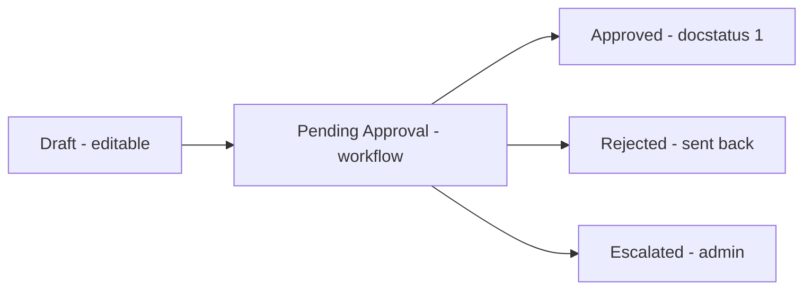

### 1.4 Role map - who does what

| Module (PLAN) | Job function | Role Profile to assign | Primary DocTypes |
|---|---|---|---|
| Administration | IT / platform owner | Solrise Administrator | User, Role, Workflow, SLA, Assignment Rule |
| HR (HRMS) | HR executive | Solrise HR Executive | Employee, Leave Allocation, Attendance Request |
| HR (HRMS) | HR manager / approver | Solrise Department Head | Leave Application, Expense Claim |
| HR (HRMS) | Employee self-service | Solrise Employee | Leave Application, Expense Claim, Issue |
| Service Desk | Support agent | Solrise Support Agent | Issue |
| Service Desk | Support supervisor | Solrise Support Supervisor | Issue, Assignment Rule |
| CRM | Sales / CRM executive | Solrise CRM Executive | Lead, Opportunity, Quotation, Contact |
| CRM | Sales manager | Solrise CRM Supervisor | Lead, Opportunity, Quotation |
| Accounts | Accountant | standard `Accounts User` | Sales Invoice, Purchase Invoice, Payment Entry |
| Accounts | Finance approver | Solrise Finance Approver | Payment Entry, Purchase Order, Sales Invoice |
| Purchasing | Purchase officer | standard `Purchase User` | Material Request, Purchase Order, Purchase Receipt |
| Portal | Customer | Solrise Customer | Issue (own records only) |

> Role Profiles are the single point of truth: change a person's Role Profile and
> their workspace, permissions and chat menu all follow. Full definitions in
> `docs/11-rbac.md` section 1.

---

## 2. Employee - self-service

**You are:** `Solrise Employee` (`Employee`).
**You own:** your own `Employee`, `Leave Application`, `Expense Claim`, `Issue`.

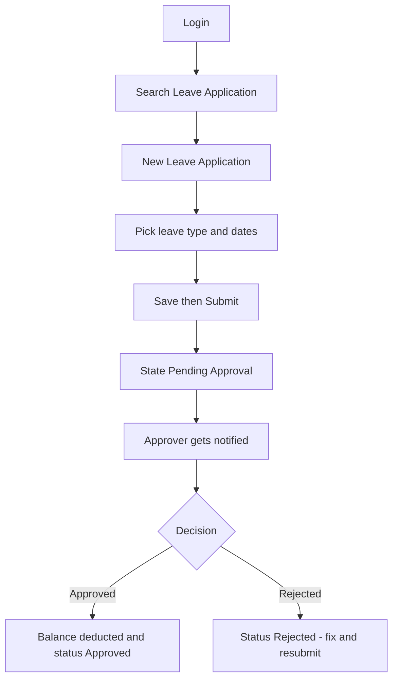

**Steps - apply for leave**
1. Search **Leave Application** -> **New**.
2. Fill **Leave Type**, **From Date**, **To Date**. Your **Employee** and
   **Company** are filled from your profile.
3. **Save**, then **Submit**. The record enters `Pending Approval`.
4. Watch the bell / email. When it is `Approved` the leave balance is deducted.

**Steps - claim an expense**
1. Search **Expense Claim** -> **New**.
2. Add an **Expense** row (type, amount, date), attach the receipt.
3. **Save** -> **Submit** -> `Pending Approval` -> Finance Approver.

**Steps - raise a service request**
1. Search **Issue** -> **New**, describe the problem, **Save**.
2. You can see and reply to only your own tickets.

**Guardrails:** you never see another employee's leave or expense; you cannot
approve your own; you cannot delete a submitted record - ask HR to cancel it.

---

## 3. HR Executive - HRMS

**You are:** `Solrise HR Executive` (`HR User`, `Employee`).
**You own:** `Employee`, `Leave Allocation`, `Attendance Request`, `Leave
Application`, `Expense Claim`, `Department`, `Holiday List`.

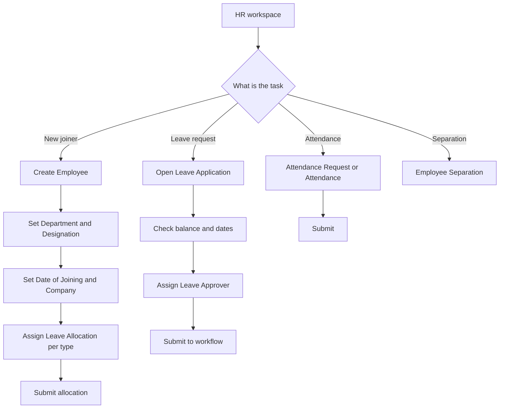

**Steps - onboard an employee**
1. **Employee** -> **New**: First Name, Gender, Date of Birth, Date of Joining,
   Company, Department, Designation. **Save**.
2. **Leave Allocation** -> **New**: employee, leave type, from/to date, days.
   **Submit**. Repeat per leave type. Without an allocation, the leave balance
   is zero and a paid leave request will be rejected on submit.
3. Confirm the employee appears under **Solrise HR Headcount**.

**Steps - process daily leave requests**
1. Open **Leave Application** list, filter `Status = Open`.
2. For each: verify the dates against the leave calendar and confirm the
   **Leave Approver** is correct.
3. **Submit**. The approver now sees the Approve/Reject actions.

**Steps - attendance**
1. **Attendance Request** for corrections, **Attendance** for daily marking.
2. Submit and let the approver/payroll consume them.

**Reports:** **Solrise HR Headcount**, **Solrise Workload**,
**Solrise Approval Backlog**.
**Guardrails:** HR is broad on rows but scoped by **Company/Department User
Permission**; no `delete` on `Employee` - use status changes or
`cancel`/`amend` on submittables.

---

## 4. HR Manager / Leave Approver / Department Head - approvals

**You are:** `Solrise Department Head`
(`Department Head`, `Leave Approver`, `Expense Approver`, `Employee`).
**You own:** approval decisions, not data entry.

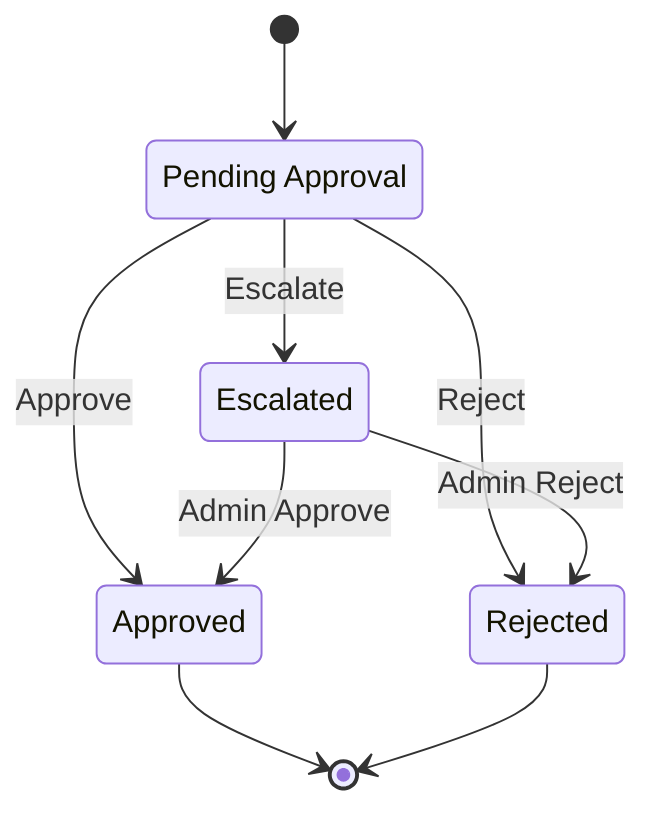

**Daily flow**

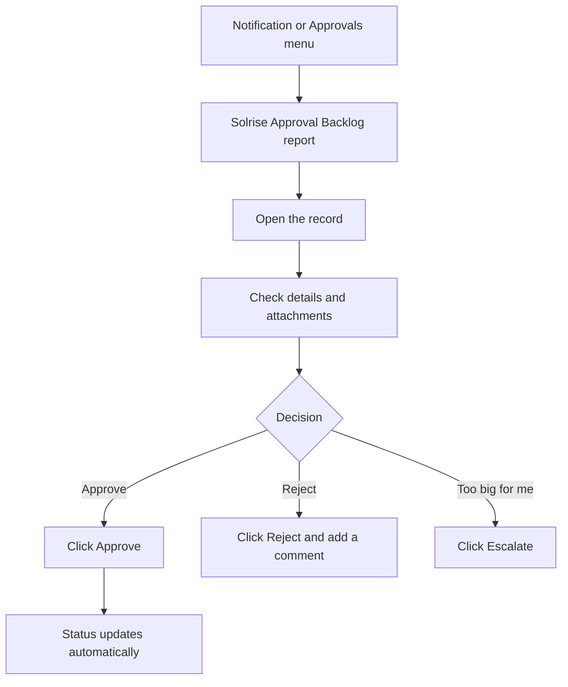

**Steps**
1. Open **Solrise Approval Backlog** (or the notification/email).
2. Open the record; read the details and any attachment.
3. Use the **Actions** button: `Approve`, `Reject` or `Escalate`.
4. Add a **comment** on Reject so the requester knows what to fix.

**Guardrails:** `allow_self_approval = 0` everywhere - you cannot approve your
own request. Approval is scoped by the workflow's allowed role (HR Manager for
leave, Finance Approver for expense) and by row rules (you are the named
approver, or in your department). Reports: **Solrise Approval Backlog**,
**Solrise HR Headcount**.

---

## 5. Support Agent - Service Desk

**You are:** `Solrise Support Agent` (`Support Agent`).
**You own:** the tickets that are yours or assigned to you.

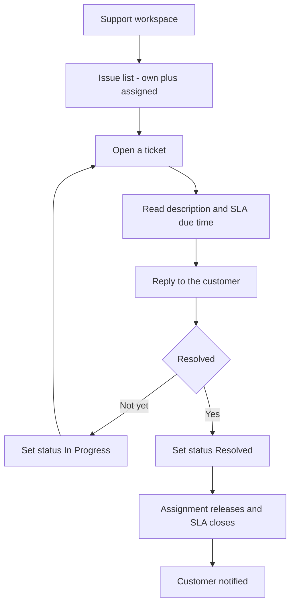

**Steps**
1. **Support** workspace -> **Issue** list. You only see tickets where you are
   the owner or the assignee.
2. Open a ticket; the SLA target and due time are shown in the header.
3. **Reply** on the ticket (the customer is emailed). Attach files if needed.
4. Update **Status**: `Open` -> `In Progress` -> `Resolved`. Setting `Resolved`
   releases the assignment and fires the resolution notification.

**Escalation:** agents cannot force an escalation. Ask your **Support Manager**,
who has the `Escalate` action.
**Reports:** **Solrise Ticket SLA**, **Solrise Agent Performance**,
**Solrise Workload**.
**Guardrails:** no `delete`; you cannot see tickets you neither own nor are
assigned; exported/report data is manager-level.

---

## 6. Support Manager - queue and SLA

**You are:** `Solrise Support Supervisor` (`Support Agent`, `Support Manager`).
**You own:** the whole ticket queue, the SLA and the Assignment Rule.

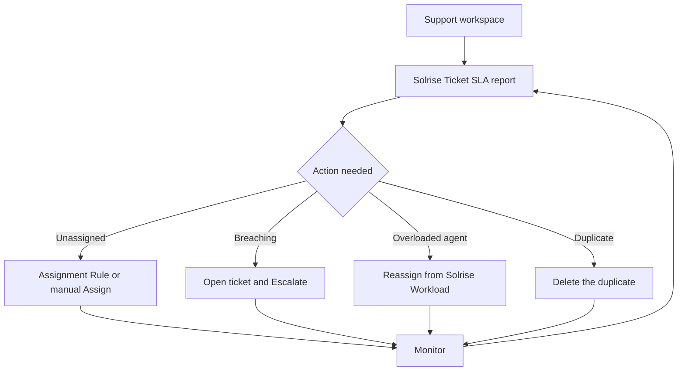

**Steps**
1. **Solrise Ticket SLA** shows open tickets by priority and due time.
2. **Assignment Rule `Solrise Support Routing`** routes new `Issue` records
   round-robin to the support users. Keep its user list current.
3. For a ticket needing escalation, open it and choose **Escalate** (moves to
   `Escalated`, tagged for `Solrise Admin`).
4. **Solrise Workload** shows per-agent open counts for rebalancing.

**Reports:** **Solrise Ticket SLA**, **Solrise Workload**,
**Solrise Agent Performance**, plus the **Solrise Operations** dashboard.
**Guardrails:** `Escalate`/`Delete` are manager-level; approvals still obey
`allow_self_approval = 0`.

---

## 7. CRM User - sales executive

**You are:** `Solrise CRM Executive` (`CRM User`).
**You own:** your leads, opportunities, contacts and quotations.

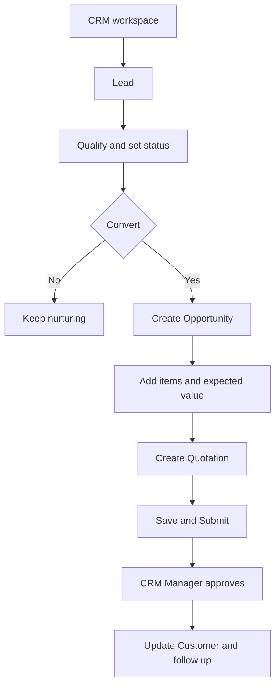

**Steps - lead to cash**
1. **Lead** -> **New**: name, company, source. Work it and set **Status**
   (`Open`, `Replied`, `Interested`, ...).
2. On qualification, **Create -> Opportunity** from the lead. Add items and the
   expected closing date.
3. From the opportunity, **Create -> Quotation**: customer, items, quantity,
   price, validity.
4. **Save**. Submitting the quotation is a **CRM Manager** action.
5. When accepted, the opportunity closes as **Converted** and the customer
   record is updated. Contacts live under **Contact**.

**Reports:** **Solrise CRM Pipeline**, plus the **Solrise Pipeline by Status**
dashboard chart.
**Guardrails:** you see only your own/assigned leads and opportunities;
`delete`, `export`, quotation `submit`/`cancel`/`amend` belong to CRM Manager.

---

## 8. CRM Manager - pipeline and quote approval

**You are:** `Solrise CRM Supervisor` (`CRM User`, `CRM Manager`).

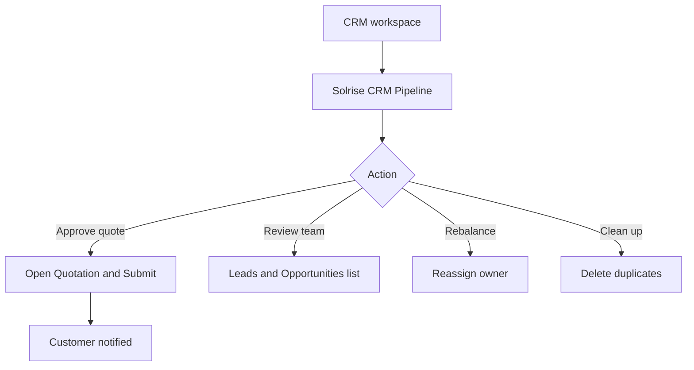

**Steps**
1. **Solrise CRM Pipeline** groups open opportunities by stage and owner.
2. Open a submitted quotation and **Submit** it, or **Cancel**/**Amend**.
3. A submitted quotation above the configured value triggers the
   **Solrise High Value Quotation** notification.
4. Reassign owners from the Lead/Opportunity list to balance the team.

**Guardrails:** self-approval is disabled on workflows; exports are manager-level
and should be handled under your data-protection policy.

---

## 9. Accountant - Accounts

**You are:** standard `Accounts User` (ERPNext Accounting).
**You own:** invoices, payment entries and reconciliation.

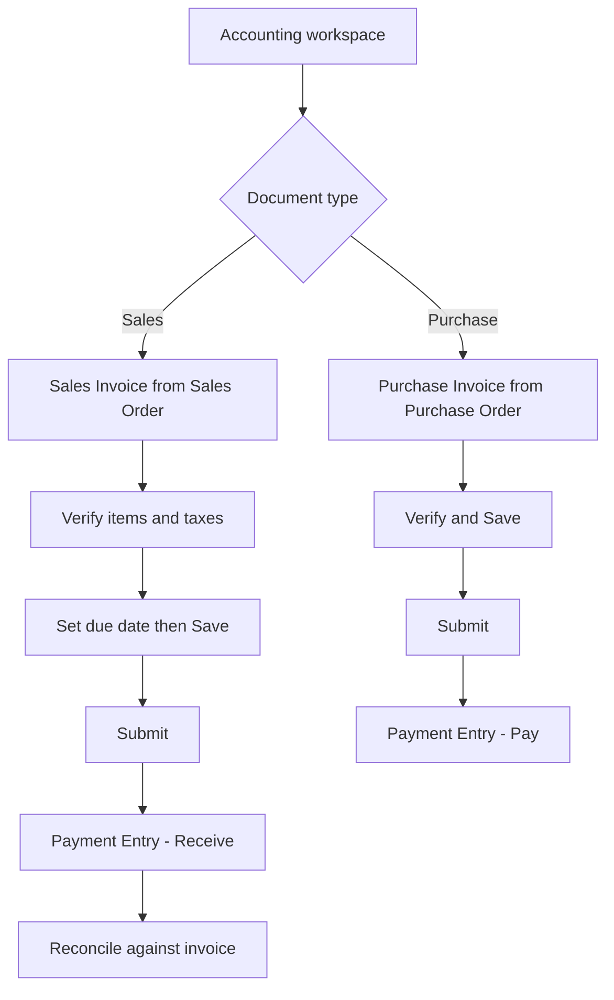

**Steps - customer invoice to cash**
1. **Sales Invoice** -> **New** (or **Create -> Sales Invoice** from a Sales
   Order). Customer, items, taxes, due date.
2. **Save** -> **Submit**. The invoice posts to the ledger.
3. **Payment Entry** -> **New**: type `Receive`, party = customer, reference the
   invoice, amount. **Submit**.
4. Reconcile the payment against the invoice so it leaves
   **Accounts Receivable**.

**Steps - supplier bill to payment**
1. **Purchase Invoice** -> **New** (or from a Purchase Order/Receipt).
2. **Save** -> **Submit**.
3. **Payment Entry** type `Pay`, reference the invoice. A large payment flows
   through the **Solrise Payment Approval** workflow.

**Reports:** standard **Accounts Receivable**, **Accounts Payable**,
**General Ledger**, **Profit and Loss**; plus **Solrise Approval Backlog** for
your pending documents.
**Guardrails:** submittable documents cannot be deleted, only **Cancel**led;
large/finance-critical documents need a Finance Approver.

---

## 10. Accounts Manager / Finance Approver - finance approvals

**You are:** `Solrise Finance Approver` (`Finance Approver`, `Employee`).
**You own:** the finance approval decisions on `Payment Entry`,
`Purchase Order` and `Sales Invoice`.

**Steps**
1. Open **Solrise Approval Backlog**, filter to finance DocTypes.
2. Check the amount, party and supporting documents.
3. **Approve** (submits the document), **Reject** with a comment, or
   **Escalate** if it exceeds your mandate.
4. Month-end: reconcile from **General Ledger** and **Accounts Receivable /
   Payable**.

**Guardrails:** no self-approval; escalation routes to `Solrise Admin`;
approving submits the document, so check it is complete first.

---

## 11. Purchase User - procurement

**You are:** standard `Purchase User`.
**You own:** the request-to-order flow.

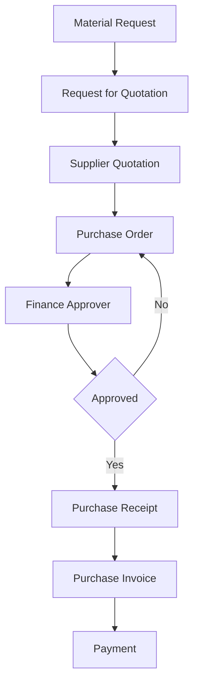

**Steps**
1. **Material Request** for what is needed; **Submit**.
2. **Request for Quotation** to suppliers -> capture **Supplier Quotation**s.
3. **Purchase Order** from the best quotation; **Save** and **Submit** into the
   **Solrise Purchase Order Approval** workflow.
4. After approval, raise the **Purchase Receipt**, then hand the
   **Purchase Invoice** to Accounts.

**Guardrails:** a PO above the threshold needs the Finance Approver;
`maintain_same_rate` and PO/PR-required settings are enforced by config.

---

## 12. Customer - Portal

**You are:** `Solrise Customer` (`Customer`, Website User).
**You own:** your own tickets and their replies.

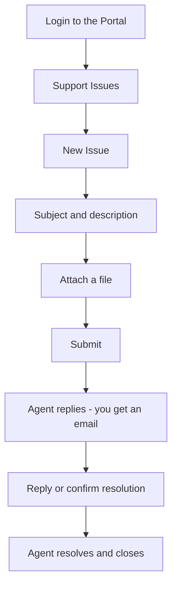

**Steps**
1. Log in to the portal and open **Support Issues**.
2. **New Issue**: subject, description, attachment. **Submit**.
3. Track replies on the ticket; you can reply but not change the status.
4. Confirm when resolved so the agent can close it.

**Guardrails:** you see only your own tickets (`if_owner` row filter); no
report/export/delete access. The portal is the same site - never share a portal
account.

---

## 13. Administrator - the platform owner

**You are:** `Solrise Administrator` (`Solrise Admin`, `System Manager`).
**You own:** users, roles, workflows, SLA, Assignment Rule, integrations, audit.

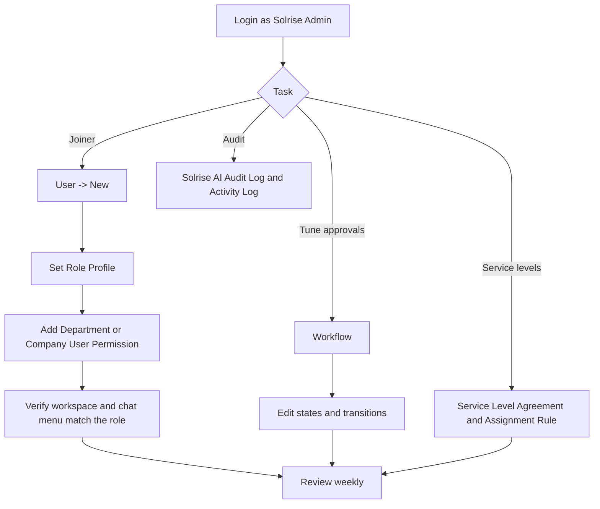

**Steps - onboard a user**
1. **User** -> **New**: email, first name, send welcome email. Set
   **User Type** = `System User` (Desk) or `Website User` (Portal).
2. Set **Role Profile** (section 1.4) - do not tick roles individually.
3. Add **User Permission** for `Company`/`Department` where row scoping is
   needed (HR, Department Head).
4. Log in as the user once to confirm the workspace and the chat quick actions
   match the role.

**Steps - operate the platform**
- Approvals live in **Workflow** (four Solrise workflows); change states or
  allowed roles there.
- Service levels in **Service Level Agreement** (`SLA-Issue-Standard`) and
  routing in **Assignment Rule** (`Solrise Support Routing`).
- Review **Solrise AI Audit Log** (chat decisions) and **Activity Log** weekly.
- Daily digests and SLA/escalation jobs run from the scheduler - see
  `docs/07-phase4-notifications-reporting.md`.

**Guardrails:** keep `System Manager` to a minimum; no daily work on the built-in
`Administrator`; enable 2FA; keep `.env` and the DB root password in a password
manager (your backups depend on it - see `docs/03` section 3.8).

---

## 14. Everyone - chat assistant, notifications, reports

### 14.1 Ask Solrise (the chat assistant)

The chat widget is on every Desk page (**Ask Solrise** in the navbar) and on the
Portal (floating button). It is permission-aware: it can only do what your role
can already do.

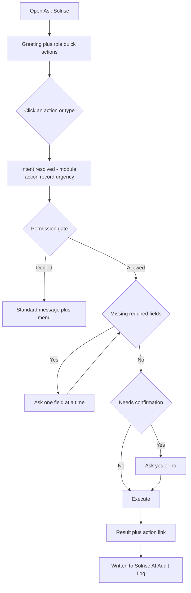

**Try this**
- `show me ticket ISS-2026-00001`
- `create a ticket for the printer offline` then answer the prompt
- `what is the status of <record>`
- `show me leave applications`
- `apply for leave`

Every allowed and denied decision is recorded in **Solrise AI Audit Log**;
chats are recorded in **Solrise Chat Log**.

### 14.2 Notifications

| Notification | Fires on | Goes to |
|---|---|---|
| Solrise New Ticket | new Issue | Support Manager |
| Solrise SLA Breach Alert | Issue passes response target | Support Manager |
| Solrise Approval Pending | document enters approval | approver |
| Solrise High Value Quotation | quotation submitted | CRM Manager |

Email requires an **Email Account**; SMS/WhatsApp requires a **Solrise
Notification Channel** and `enable_messaging`.

### 14.3 Reports and dashboard by role

| Report | Best for |
|---|---|
| Solrise CRM Pipeline | CRM User/Manager |
| Solrise High Value Quotation (notification) | CRM Manager |
| Solrise Ticket SLA | Support Agent/Manager |
| Solrise Agent Performance | Support Manager |
| Solrise Workload | Support Manager / Department Head |
| Solrise HR Headcount | HR |
| Solrise Approval Backlog | every approver |
| Solrise Assistant Usage | Administrator |
| Solrise Message Delivery | Administrator |
| Solrise Audit Trail | Administrator |

Dashboard **Solrise Operations** holds five charts: Open Tickets by Status,
Ticket Trend, Pipeline by Status, Headcount by Department, Assistant Turns.

---

## 15. Training sign-off checklist

Use one row per trainee. The trainee performs the flow unaided.

| Role | Demonstrate end to end | Done |
|---|---|---|
| Employee | create + submit a Leave Application; reply to own Issue | [ ] |
| HR Executive | onboard an Employee; create a Leave Allocation; triage requests | [ ] |
| HR Manager | approve and reject a Leave Application; escalate one | [ ] |
| Support Agent | resolve an assigned Issue; reply to the customer | [ ] |
| Support Manager | reassign from Workload; escalate; read Ticket SLA | [ ] |
| CRM User | Lead -> Opportunity -> Quotation | [ ] |
| CRM Manager | submit a Quotation; read Pipeline | [ ] |
| Accountant | Sales Invoice -> Submit -> Payment Entry -> reconcile | [ ] |
| Finance Approver | approve a Payment Entry and a Purchase Order | [ ] |
| Purchase User | Material Request -> Purchase Order -> Receipt | [ ] |
| Customer | raise and track a portal Issue | [ ] |
| Administrator | onboard a user with a Role Profile; read the audit log | [ ] |

---

## 16. "Why can't I ..." quick reference

| Symptom | Cause | Fix |
|---|---|---|
| A module is missing from the sidebar | role/Role Profile not assigned | assign the Role Profile (section 1.4) |
| A list is empty | row filter - nothing owned or assigned | get assigned, or check `_assign` |
| No Approve/Reject button | not the allowed approver, or self-approval | use the correct approver account |
| Cannot submit a document | submit permission not granted | request it from the Administrator |
| Chat says you don't have permission | the gate mirrors your real permissions | request access; the denial is logged |
| A paid leave submit fails | no Leave Allocation for that type | ask HR to allocate leave |
| Restore/backup fails | `DB_ROOT_PASSWORD` missing | see `docs/03` section 3.8e |

---

## See also

- `docs/PLAN.md` - module scope and milestone status
- `docs/11-rbac.md` - role catalogue, permission matrix, row rules
- `docs/02-phase2-module-config.md` - what code configures
- `docs/12-phase5-universal-chat-entry-flow.md` - chat assistant design and tests
- `docs/07-phase4-notifications-reporting.md` - notifications and reports
