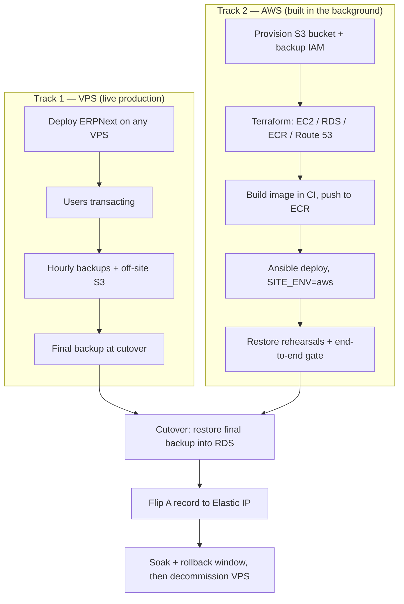

# VPS → AWS Migration & Cutover Strategy

**Goal:** go live on *any* VPS immediately (users transacting on day one), build the
AWS deployment in the background with zero user impact, then switch DNS to
Route 53 once AWS is stable end-to-end — with the VPS data recoverable to within
**one hour** at all times and the cutover driven by a restore of that backup.

This is the bridge between the two existing playbooks:

- **Live-now path:** [`docs/03-phase3-production-vps.md`](03-phase3-production-vps.md) (single-host VPS, MariaDB in a container).
- **Target path:** [`infra/README.md`](../infra/README.md) (EC2 + RDS MariaDB via Terraform/Ansible).

---

## TL;DR

| Requirement | Mechanism in this repo |
|---|---|
| "Backed up till the last hour" on the VPS | Hourly `scripts/backup.sh` (full logical dump: DB + public + private files), guarded with `flock`, pushed off-host to S3 |
| "Restore the backup and good to go" on AWS | The same dump is pulled from S3 and loaded with `scripts/restore.sh <dir> --new` against RDS (`SITE_ENV=aws`) |
| "Flip DNS to Route 53 once stable" | Migrate the zone to Route 53 early (keep `A` → VPS), then at cutover change only the `A` record to the Elastic IP (TTL 60) |

The S3 backup bucket is the **single object** that connects both requirements:
the VPS writes to it from day one (disaster-recovery + off-site safety), and the
AWS stack reads from it at cutover (migration). It is also the *first* AWS
resource you should create.

---

## 1. RPO / RTO targets

| Term | Target | Meaning |
|---|---|---|
| **RPO** (ongoing) | **≤ 1 hour** | At any moment the newest restorable dump is at most 60 minutes old. If the VPS dies, you lose at most one hour of work. |
| **RPO** (at cutover) | ~minutes | A final backup is taken immediately before the write freeze, so the cutover itself loses nothing. |
| **RTO** (disaster) | ≤ 2 hours | Time from "VPS dead" to "a fresh stack is serving the latest dump". Measured, not assumed — see §6.1. |
| **Cutover window** | ≤ 1 hour | Read-only freeze + restore + verify + DNS flip. Sized from the measured restore time (§6.3). |

> "Till the last hour" is satisfied by the **hourly** schedule. The final
> cutover backup is what *tightens* that to minutes at the one moment it
> matters most.

---

## 2. Strategy at a glance

Two parallel tracks that converge at a single DNS flip:



The VPS is never taken down to build AWS. Users keep working on the VPS until
the DNS record changes — and the VPS stays up as a rollback target afterwards.

---

## 3. Phase A — Stabilize production on the VPS

Done **before** (or immediately after) users start transacting. Nothing here is
AWS-specific; it is what makes requirement #1 true.

### A1. Hourly backups

The existing daily cadence in
[`docs/04-operations-runbook.md`](04-operations-runbook.md) §2.2 is a daily cron.
For a 1-hour RPO, switch it to hourly on the VPS crontab:

```cron
# Full logical backup every hour at :12 (database + public + private files)
12 * * * * flock -n /var/lock/solrise-backup.lock -c \
  'cd /home/deploy/solrise-erp && SITE_ENV=prod BACKUP_DIR=/var/backups/solrise ./scripts/backup.sh' \
  >> /var/log/solrise-backup.log 2>&1
```

Why `flock -n`:

- `scripts/backup.sh` has no internal lock. A full logical dump of a large ERP
  database can take tens of minutes; if a run ever exceeds an hour, an unlocked
  hourly cron would overlap the next run and corrupt the dump set.
- `flock -n` **skips** the run if the previous one still holds the lock, which is
  the safe behaviour for a backup (a missed hourly slot is still within RPO as
  long as the *previous* completed run is recent).

Validate the assumption early: time the first few dumps. If a dump approaches or
exceeds ~50 minutes, you need either a faster dump method or a shorter interval.

### A2. Off-host copy (this is the migration vehicle)

A backup that lives on the VPS is not a backup. Push every dump off the VPS:

```cron
# Sync the backup dir to S3 five minutes after each dump
17 * * * * flock -n /var/lock/solrise-backup.lock -c \
  'aws s3 sync /var/backups/solrise s3://<backup-bucket>/vps/ --region <region>' \
  >> /var/log/solrise-backup.log 2>&1
```

- Use the **Terraform-managed backup bucket** (`infra/terraform/storage.tf`):
  SSE-S3, versioning, public access blocked, lifecycle expiry. It is the same
  bucket the AWS deployment reads from at cutover.
- Create it **first** in Phase B (§4.1) — even before the app tier — so the VPS
  has an off-site target from day one. Until it exists, the VPS keeps local
  dumps as a stopgap and you accept single-host risk.
- The VPS needs a least-privilege IAM principal scoped to `s3:PutObject` on that
  bucket only (never static root keys; prefer a dedicated IAM user or an OIDC
  role). Store those credentials in the VPS's `.env`/password manager, not the
  repo.

### A3. Retention and disk sizing

- Local (`/var/backups/solrise`): keep only a short window — e.g.
  `BACKUP_RETENTION_DAYS=7` — because hourly full dumps are large. S3 is the
  long-term store.
- S3: lifecycle on the bucket expires objects after `backup_retention_days`, and
  versioning keeps prior versions for `noncurrent_days = 30` (already configured
  in `storage.tf`). Tune both to your compliance window.

### A4. Prove restorability

A backup you have never restored is untested. Rehearse **on the VPS** into a
throwaway stack before you need it (see
[`docs/03-phase3-production-vps.md`](03-phase3-production-vps.md) §3.8e, which is
already verified for this repo):

```bash
SITE_ENV=prod ./scripts/restore.sh ./backups/<stamp> --new
```

Record: dump size, dump duration, restore duration. These three numbers size the
cutover window in §6.3.

---

## 4. Phase B — Build AWS in the background

Non-disruptive. Users stay on the VPS. Follow
[`infra/README.md`](../infra/README.md) and
[`infra/PREREQUISITES.md`](../infra/PREREQUISITES.md); the ordering below is the
migration-specific emphasis.

### B1. First resource: the S3 bucket + backup IAM

Create the S3 backup bucket and the VPS backup principal **before anything else**.
This unblocks Phase A's off-site copy and means every hour of live data is
already flowing into AWS object storage long before cutover.

### B2. Provision the app tier (Terraform)

```bash
cd infra/terraform
cp terraform.tfvars.example terraform.tfvars && $EDITOR terraform.tfvars
terraform init && terraform apply
```

Creates: VPC/subnets/SGs, EC2 + Elastic IP, RDS MariaDB (+ Secrets Manager
password), ECR, S3 bucket, IAM/OIDC, and — if `route53_zone_id` is set — the
Route 53 `A` record.

### B3. Image → ECR (CI)

```bash
gh workflow run build-image.yml -f tag=version-15
gh run watch
```

Then deploy with Ansible (`SITE_ENV=aws` under the hood):

```bash
cd infra/ansible
ansible-galaxy collection install -r requirements.yml
ansible-playbook site.yml --ask-vault-pass
```

This pulls the image (no host build), renders `.env` from the Terraform facts,
brings the stack up against RDS, creates the site, installs the boot unit and
backup cron.

### B4. Prepare DNS early (do NOT wait for cutover)

Move authoritative DNS to Route 53 **now**, while it is still pointing at the VPS:

1. Create a Route 53 hosted zone for the domain.
2. Copy every existing record (including the `A` for `erp.<domain>` → **VPS IP**)
   into the hosted zone.
3. Update the registrar's nameservers to the four Route 53 NS values.
4. Wait for delegation (usually minutes–48 h; verify with `dig +trace`).
5. Lower the `A` record TTL to **60 seconds** and leave it at the VPS IP.

Doing the **zone** migration ahead of time means the only thing that changes at
cutover is a single `A` record value — a change that propagates in ~60 s and
reverts just as fast. (Switching nameservers *during* cutover would couple your
go-live to a 24–48 h propagation delay — the classic mistake to avoid.)

If you do not want to move the whole zone, the alternative is to keep DNS at the
current provider and simply change the `A` record to the Elastic IP at cutover;
you lose the Route 53 control-plane but keep the same fast, reversible flip.

### B5. Restore rehearsals into AWS (dry-run migration)

Before cutover, run the *actual* migration against the AWS stack repeatedly with
a real (or recent) VPS backup:

```bash
# on the EC2 host
cd /opt/solrise-erp
aws s3 sync s3://<backup-bucket>/vps/<stamp> /tmp/solrise-backup/<stamp> --region <region>
SITE_ENV=aws ./scripts/restore.sh /tmp/solrise-backup/<stamp> --new
```

`restore.sh` talks to whatever `db_host` points at, so it loads the dump into
RDS using the `DB_ROOT_USERNAME` / `DB_ROOT_PASSWORD` rendered by Ansible.
Measure restore duration each time — this is your RTO.

### B6. End-to-end stability gate

Hold cutover until every one of these is green:

- [ ] Terraform `apply` clean; no drift on re-plan.
- [ ] Image present in ECR; EC2 pulls it; stack healthy (`make aws-logs`, `make aws-up`).
- [ ] `https://<site>/api/method/ping` → `200` (Ansible already gates on this).
- [ ] A **full restore rehearsal** into RDS succeeded, with a data fingerprint check (§6.4).
- [ ] DNS is on Route 53, `A` still → VPS, TTL 60.
- [ ] RDS automated snapshots + PITR enabled (`db_backup_retention_days`).
- [ ] S3 backup sync from the VPS is current (no lag > 1 h).

Because the domain still resolves to the VPS, validate the AWS stack end-to-end
*without* DNS using a hosts-file override:

```bash
curl --resolve <domain>:443:<elastic-ip> https://<domain>/api/method/ping -I
```

This is the same `--resolve` technique used for the workstation rehearsal in
[`docs/03`](03-phase3-production-vps.md) §3.10. The only thing not provable this
way is the real Let's Encrypt issuance, which completes in seconds after the DNS
flip.

---

## 5. Phase C — Cutover

The only user-visible event in the whole plan. Keep it short and scripted.

### C0. Go / no-go preflight

- [ ] Phase B gate (§4.6) all green, including a restore rehearsal within the last 24 h.
- [ ] Latest VPS dump synced to S3; `aws s3 ls` confirms the timestamp.
- [ ] Announce a maintenance window; have the rollback command ready (§7).
- [ ] Two operators: one on the VPS, one on AWS (or one with both terminals open).

### C1. Freeze writes

```bash
# on the VPS
podman exec -it solrise-backend bench --site <domain> set-maintenance-mode on
```

This stops users writing but keeps the app reachable (read-only maintenance
page). If the app must stay fully available, skip straight to the final backup
and accept the small in-flight write window.

### C2. Final backup + push

```bash
# on the VPS
SITE_ENV=prod BACKUP_DIR=/var/backups/solrise ./scripts/backup.sh
aws s3 sync /var/backups/solrise s3://<backup-bucket>/vps/ --region <region>
```

This is the "last hour → last minute" tightening: it captures everything up to
the freeze.

### C3. Restore into AWS

```bash
# on the EC2 host
cd /opt/solrise-erp
aws s3 sync s3://<backup-bucket>/vps/<stamp> /tmp/solrise-backup/<stamp> --region <region>
SITE_ENV=aws ./scripts/restore.sh /tmp/solrise-backup/<stamp> --new
```

### C4. Verify before touching DNS

```bash
# data fingerprint: counts must match the VPS's pre-freeze numbers
podman exec -it solrise-backend bench --site <domain> execute \
  'frappe.db.count("User"), frappe.db.count("Issue"), frappe.db.count("Lead")'
```

Spot-check a CRM lead, an open Issue, an employee record and a report (same list
as [`docs/03`](03-phase3-production-vps.md) §3.8d). The `--resolve` override from
§4.6 lets you browse the AWS stack directly if you want a human eyeball before
the public flip.

### C5. Flip DNS

```bash
# Route 53: change only the A record value -> Elastic IP (TTL 60)
aws route53 change-resource-record-sets --hosted-zone-id <zone-id> --change-batch '...'
```

Or edit the record in the console. Watch the flip and the cert issuance:

```bash
dig +short <domain>              # should now return the Elastic IP
curl -I https://<domain>         # expect a valid cert, then a 302 to /login
```

Traefik obtains the Let's Encrypt certificate on the first HTTPS request to the
new IP (HTTP-01). Avoid flapping the record back and forth — that risks LE rate
limits.

### C6. Take the VPS out of maintenance

Once traffic is on AWS and verified, disable maintenance mode on the VPS (it is
now a rollback target, not the active site) or leave it as-is until
decommissioning.

---

## 6. Verification

### 6.1 Measure the RPO

- Confirm the S3 `vps/` prefix never lags by more than 60 minutes (monitor the
  cron log / `aws s3 ls`).
- Kill a throwaway stack and restore the newest dump; confirm no more than one
  hour of data is missing.

### 6.2 Measure the RTO

Time `restore.sh --new` end-to-end during a rehearsal. That number — plus the
DNS TTL — is your committed RTO. Record it in the operations log.

### 6.3 Size the cutover window

`cutover ≈ final backup + S3 sync + restore + verify + DNS TTL`. With an hourly
RPO the final backup is small relative to a cold start; the restore is the
dominant term. Rehearsals give you the real number.

### 6.4 Data fingerprint

Define a small set of row counts that must match VPS-before and AWS-after (users,
leads, issues, employees, workflow states). Store them in the cutover checklist so
"restored correctly" is a number, not a feeling.

---

## 7. Rollback & failure handling

| Situation | Action |
|---|---|
| Restore fails or data mismatch at §5.4 | Stop. Fix and re-run the restore; do **not** flip DNS. VPS is still live. |
| Post-flip outage (app or cert) | Flip the `A` record back to the VPS IP (TTL 60). VPS has the last backup and was in maintenance. |
| Post-soak issue after users wrote to AWS | Reverse migration: `SITE_ENV=aws ./scripts/backup.sh` on AWS, restore onto the VPS with `--new`, flip DNS back. Data written to AWS after cutover is the source of truth. |
| VPS dies during Phase A | Rebuild a VPS and `restore.sh --new` from the newest S3 dump (RPO ≤ 1 h). |
| AWS account not ready by the planned cutover | Keep running on the VPS — that is the whole point of the two-track design. No deadline forces a premature flip. |

**The one-way door:** once DNS points at AWS *and users resume writing*, the VPS
is stale. Until that moment, rollback is a cheap record flip. This is why the
soak period (§8) keeps the VPS untouched.

---

## 8. Phase D — Soak, then decommission

1. **Soak (≥ 7 days):** keep the VPS up and its hourly backups running. Monitor
   AWS error logs, scheduler, and the `solrise_letsencrypt` renewal (first renewal
   happens ~60 days out; confirm the ACME email and `main-resolver` are correct).
2. **Freeze the VPS** as a cold standby: stop the stack but keep the volumes and
   the last dump. Confirm RDS automated snapshots/PITR are healthy.
3. **Decommission** the VPS only after the soak passes and a clean RDS restore has
   been demonstrated from AWS-native backups (not just from the VPS dump).

---

## 9. Risks & mitigations

| Risk | Mitigation |
|---|---|
| Hourly full dump exceeds 1 h (overlap) | `flock -n`; measure dump time; shorten interval or add binlog PITR |
| Backup not actually restorable | Mandatory restore rehearsal (§4.5, §A4) before cutover |
| DNS NS switch propagates slowly | Migrate zone early; change only the `A` record at cutover (§4.4) |
| Cert issuance delay / LE rate limit | Pre-validate with `--resolve`; don't flap DNS; correct ACME email in `.env` |
| Data divergence after cutover | Soak period + reverse-restore runbook (§7) |
| VPS and AWS both write simultaneously | Write freeze at §5.1 closes this window |
| Secrets (`DB_ROOT_PASSWORD`) lost | Back up `.env` + secrets off-host; they are what make dumps restorable |
| S3 lag > 1 h unnoticed | Monitor the sync cron; alert on the newest object timestamp |

---

## 10. Success criteria

- [ ] VPS hourly backups green for 7 consecutive days; newest dump ≤ 60 min old.
- [ ] At least two successful restore rehearsals into AWS RDS with matching data fingerprint.
- [ ] AWS end-to-end stable via `--resolve` before the public flip.
- [ ] Cutover completed within the announced window; DNS on Route 53 pointing at the Elastic IP.
- [ ] Soak period completed with no data loss; VPS decommissioned only after an RDS-native restore is proven.

---

## References

- Live-now VPS: [`docs/03-phase3-production-vps.md`](03-phase3-production-vps.md)
- Backup/restore operations: [`docs/04-operations-runbook.md`](04-operations-runbook.md)
- AWS provisioning: [`infra/README.md`](../infra/README.md)
- AWS prerequisites: [`infra/PREREQUISITES.md`](../infra/PREREQUISITES.md)
- Master plan/milestones: [`docs/PLAN.md`](PLAN.md)
