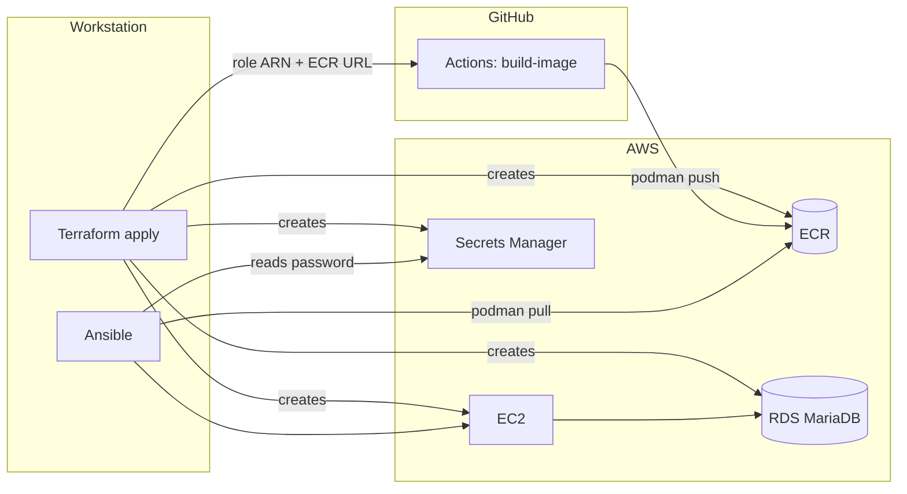

# Deploying Solrise ERP on AWS (EC2 + RDS MariaDB) with Terraform and Ansible

This directory is the AWS deployment path from the main README: the application
runs on **EC2**, the database is **MariaDB on RDS**, infrastructure is
provisioned by **Terraform**, and the host is configured and deployed by
**Ansible**.

The image is built **once in GitHub Actions and pushed to ECR** — the slow bake
(frappe + erpnext + hrms + the custom app, ~15 min, memory-hungry) never runs on
the production host. Ansible only pulls it.

> **Read [`PREREQUISITES.md`](PREREQUISITES.md) first.** It lists every account,
> key, credential and GitHub setting you need before `terraform init` and before
> `ansible-playbook`, plus the minimum IAM policies.

The in-repo VPS path (`docs/03-phase3-production-vps.md`) runs everything on one
host with MariaDB in a container. This path replaces only the database container
with managed RDS — the app tier is otherwise identical.

## Image supply chain



## Division of labour

| Concern | Tool | Files |
|---|---|---|
| VPC, subnets, security groups | Terraform | `terraform/network.tf`, `terraform/security.tf` |
| EC2 + Elastic IP + IAM/SSM role | Terraform | `terraform/compute.tf`, `terraform/iam.tf` |
| RDS MariaDB + parameter group (utf8mb4) | Terraform | `terraform/rds.tf` |
| RDS master password (generated + rotated) | Terraform (AWS-managed) | `terraform/rds.tf` → Secrets Manager |
| ECR repository + S3 backup bucket | Terraform | `terraform/storage.tf` |
| GitHub OIDC provider + CI push role | Terraform | `terraform/github_oidc.tf` |
| Route 53 A record | Terraform | `terraform/dns.tf` |
| Terraform → Ansible handoff | Terraform | `terraform/outputs.tf` → `ansible/inventory/hosts.ini`, `ansible/group_vars/all/terraform.yml` |
| **Image build + push to ECR** | **GitHub Actions** | `.github/workflows/build-image.yml`, `scripts/build-image.sh`, `scripts/push-image.sh` |
| OS hardening, rootless Podman, podman socket | Ansible | `ansible/roles/host` |
| `.env`, image pull, stack, site, systemd, backups | Ansible | `ansible/roles/solrise` |

## The app-side prerequisite

RDS is external, so the stack uses **`compose/compose.aws.yaml`** — identical to
`compose.prod.yaml` minus the `mariadb` service, with `DB_HOST`/`DB_PORT` read
from `.env` and site creation using the RDS master user. That is wired through the
rest of the repo:

- `SITE_ENV=aws` selects it (`scripts/lib.sh`), so `backup.sh`, `restore.sh`,
  `create-site.sh` and `run-python.sh` all work unchanged.
- `make aws-up` / `aws-down` / `aws-logs` are the Make targets.
- `scripts/create-site.sh` skips the "wait for mariadb" step when there is no
  embedded database.

## Prerequisites (summary)

Full detail in [`PREREQUISITES.md`](PREREQUISITES.md). In short, before
`terraform init` you need: an AWS account + region, AWS credentials for a
principal that can create the resources, an SSH key pair, a domain + ACME email,
and the GitHub repo slug for OIDC. Before Ansible you additionally need: AWS
credentials on the control node, the SSH private key, an Ansible Vault password,
and **the image already in ECR**.

## 1. Provision (Terraform)

```bash
cd infra/terraform
cp terraform.tfvars.example terraform.tfvars
$EDITOR terraform.tfvars          # domain, email, SSH key, github_repository, ssh_cidr_blocks
terraform init
terraform apply
```

`apply` writes two files consumed by Ansible:

- `infra/ansible/inventory/hosts.ini` — the host and its IP (gitignored)
- `infra/ansible/group_vars/all/terraform.yml` — RDS endpoint, secret ARN, domain, ECR URL, bucket

Record the outputs you need next:

```bash
terraform output github_actions_role_arn   # -> GitHub variable AWS_ROLE_ARN
terraform output ecr_repository_url        # -> GitHub variable ECR_REPOSITORY_URL
terraform output app_public_ip
terraform output rds_endpoint
```

> **Engine version.** Confirm RDS offers what you set:
> `aws rds describe-db-engine-versions --engine mariadb --query 'DBEngineVersions[].EngineVersion'`.
> `db_engine_version` and `db_parameter_group_family` must match (`11.4` ↔ `mariadb11.4`).

## 2. Build the image in CI (GitHub Actions)

Set the repository variables/secrets from `PREREQUISITES.md` §4, then run the
workflow:

```bash
gh workflow run build-image.yml -f tag=version-15
gh run watch
```

It assumes the Terraform-created role via **OIDC** (no static AWS keys), logs in
to ECR, builds `scripts/build-image.sh`, and pushes `scripts/push-image.sh`. On
success the tag is:

```
<acct>.dkr.ecr.<region>.amazonaws.com/solrise/erpnext:version-15
```

`CUSTOM_TAG` (GitHub) must equal `custom_tag` in
`infra/ansible/group_vars/all/main.yml`. To rebuild on every merge to `main`, just
push a change to `apps.json` or the build scripts — the workflow also triggers on
those paths.

> Offline fallback: set `enable_ecr = false` in `terraform.tfvars` and
> `rebuild_image: true` in `group_vars/all/main.yml` to build on the EC2 host
> instead. This reintroduces the ~15-minute host build and is not the default.

## 3. Secrets (Ansible Vault)

The RDS master password is **not** in Vault or in `.tfvars` — AWS generates it,
rotates it, and stores it in Secrets Manager. You only supply the Frappe
`Administrator` password:

```bash
cd infra/ansible
cp group_vars/all/vault.example.yml group_vars/all/vault.yml
$EDITOR group_vars/all/vault.yml          # set vault_admin_password
ansible-vault encrypt group_vars/all/vault.yml
```

Point `repo_url`, `solrise_app_url` and branches at your repositories in
`group_vars/all/main.yml`.

## 4. Configure and deploy (Ansible)

```bash
cd infra/ansible
ansible-galaxy collection install -r requirements.yml
ansible-playbook site.yml --ask-vault-pass
```

The playbook:

1. installs podman, `podman-compose`, git, `awscli`, ufw, fail2ban; creates swap
   and the sysctl values Redis/Traefik/rootless Podman need;
2. enables lingering + the rootless `podman.socket`;
3. clones the repo to `/opt/solrise-erp`, renders `.env` from the Terraform facts
   and Vault (RDS endpoint, generated master password, domain, ECR image);
4. **logs in to ECR and pulls the image** (no build), brings the stack up
   (`make aws-up`), and creates the site — which reaches RDS with
   `DB_ROOT_USERNAME`/`DB_ROOT_PASSWORD`;
5. installs a **rootless user systemd unit** so the stack comes back after reboot,
   and a daily backup cron (optionally syncing files to S3);
6. gates on `GET https://<site>/api/method/ping` returning 200 (Let's Encrypt
   issuance is part of that wait).

Scope the run when iterating:

```bash
ansible-playbook site.yml --tags host   --ask-vault-pass  # OS prep only
ansible-playbook site.yml --tags deploy --ask-vault-pass  # redeploy only
```

## 5. Redeploying after a code change

- **App image changed** → push to `main` (or run the workflow), then:
  ```bash
  ansible-playbook site.yml --tags deploy --ask-vault-pass
  ```
- **Only config/scripts changed** → just re-run the `deploy` tag; `rebuild_image`
  is already `false`, so the image is not rebuilt.
- **Pin a rollback** → run the workflow with an older `tag`, set that tag in
  `group_vars/all/main.yml`, and re-run `deploy`. `PULL_POLICY=always` makes the
  host fetch the newly tagged image.

## 6. Migrating existing data onto RDS

The existing backup/restore path works because the restore talks to whatever
`db_host` points at:

```bash
# workstation, from the repo root
make backup                                    # ./backups/<stamp>/
scp -r backups/<stamp> ubuntu@<eip>:/tmp/solrise-backup

# on the EC2 host
cd /opt/solrise-erp
SITE_ENV=aws BACKUP_DIR=/tmp/solrise-backup ./scripts/restore.sh /tmp/solrise-backup/<stamp> --new
```

`DB_ROOT_USERNAME` and `DB_ROOT_PASSWORD` come from the rendered `.env`; the
restore creates the site and loads the dump into RDS. Public/private files land
on the EBS volume (and are what the S3 sync protects).

## 7. Day-two operations

| Task | Command |
|---|---|
| Stack status | `SITE_ENV=aws make ps` (or `make aws-logs`) |
| Shell on the host | `ssh ubuntu@<eip>` or `aws ssm start-session --target <instance-id>` |
| Bench shell | `podman exec -it solrise-backend bash` |
| Migrate | `podman exec -it solrise-backend bench --site <site> migrate` |
| DB snapshot / PITR | RDS console (automated, `db_backup_retention_days`) |
| File backups | `/opt/solrise-erp/backups` + optional `s3://<bucket>/files/` |
| Rotate master password | Secrets Manager rotation on the RDS-managed secret |
| Traefik cert | `openssl s_client -connect <domain>:443 -servername <domain>` |
| Rebuild image | `gh workflow run build-image.yml` |

## 8. Teardown

`db_deletion_protection = true` and a final snapshot are on by default. For a
throwaway stack set `db_deletion_protection = false` and (optionally)
`db_skip_final_snapshot = true`, then:

```bash
cd infra/terraform && terraform destroy
```

The EBS volumes are deleted with the instance; RDS keeps its final snapshot. The
ECR repository is retained unless you remove it too.

## Known limitations / follow-ups

- The **rootless user systemd unit** is the one piece that needs verification on a
  live host: `systemctl --user status solrise` should show it active after
  `loginctl enable-linger`. (The repo previously relied only on container restart
  policies, which do not bring a rootless stack up at boot.)
- `awscli` comes from apt (v1); if your distro lacks the package, install the v2
  bundle and adjust the ECR login / S3 cron.
- The S3 backup sync is **off** by default (`backup_s3_enabled: false`); turn it on
  once you have confirmed credentials work on the host.
- Read replicas are not wired into Frappe; the RDS endpoint is a single writer.
- The CI workflow triggers on `main` by default. Adjust the branch filter and
  `github_oidc_branch` together if you deploy from another branch.
